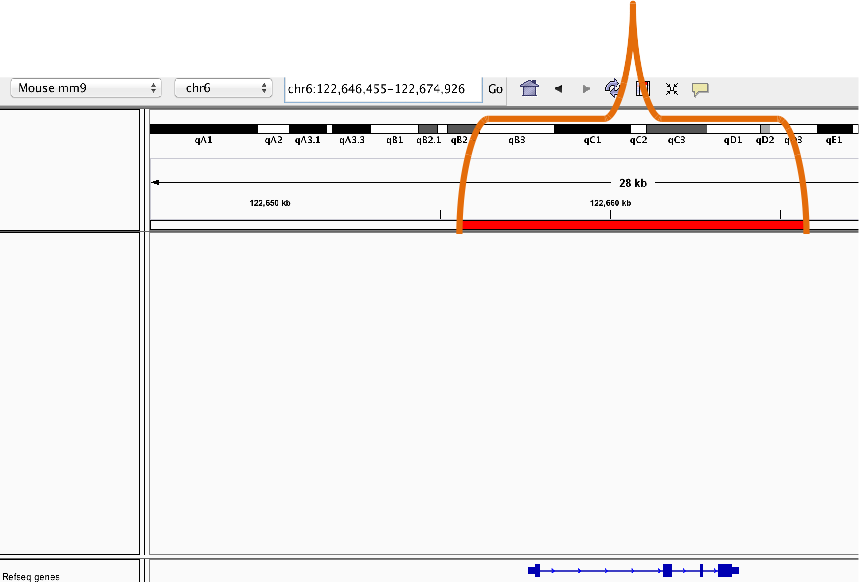

```{r setup, include=FALSE}
knitr::opts_chunk$set(echo = TRUE)
AsSlides <- TRUE
library(TxDb.Mmusculus.UCSC.mm10.knownGene)
library(GenomicAlignments)
library(DESeq2)
library(tximport)
library(org.Mm.eg.db)
library(goseq)
library(DEXSeq)
library(limma)
library(rtracklayer)
"%in%" <- BiocGenerics::"%in%"
```

##The Course 

 
 
* The Course 
* [Importance of Visualising Genomics Data](#/vizdata). 
* [Reminder of file types](#/filetypes) 
* [Reminder of data types](#/datatypes) 
* [Materials](#/materials) 
* [Visualising genomics data in R](#/VizinR) 
* [Plotting genome axis](#/genomeaxis) 
* [Plotting genome data](#/datatracks) 
* [Plotting genome annotation](#/Annotation) 
* [Plotting genome sequence](#/seqtrack) 
* [Plotting genomic alignments](#/genomeaxis) 
* [Plotting from external databases](#/externaldata) 

---
##Importance of Visualising Genomics Data. 

It is an essential step in genomics data analysis to visualise your data. This allows you to review data for both known or unexpected data characteristics and potential artefacts. 
 
While we have discussed using IGV to review genomics data, now we will discuss how to do this while still working with in the R. 

---
##Visualising Genomics Data in R/Bioconductor. 

 
In complement to our [IGV genome browser course](https://rockefelleruniversity.github.io/IGV_course/) where we reviewed visualising genomics data in a browser, here we will use R/Bioconductor to produce publication quality graphics programatically.  
 
Much of the material will require some familiarity with R and Bioconductor [(you can revisit our courses on those here)](https://rockefelleruniversity.github.io/) and these will be used in tight conjunction with tools introduced today such as the Bioconductor package, **Gviz**. 
---
##Reminder of file types 

In this session we will be dealing with a range of data types. For more information on file types you can revisit our material. 
 
* [File Formats](https://rockefelleruniversity.github.io/Genomic_Data/). 
 
For more information on visualising genomics data in browsers you can visit our IGV course. 
 
* [IGV](https://rockefelleruniversity.github.io/IGV_course/). 
---
##Reminder of data types in Bioconductor 

We will also encounter and make use of many data structures and data types which we have seen throughout our courses on HTS data. You can revisit this material to refresh on HTS data analysis in Bioconductor and R below. 
 
* [Bioconductor](https://rockefelleruniversity.github.io/Bioconductor_Introduction/). 
* [Genomic Intervals](https://rockefelleruniversity.github.io/Bioconductor_Introduction/r_course/presentations/slides/GenomicIntervals_In_Bioconductor.html)
* [Genomic Scores](https://rockefelleruniversity.github.io/Bioconductor_Introduction/r_course/presentations/slides/GenomicScores_In_Bioconductor.html)
* [Sequences](https://rockefelleruniversity.github.io/Bioconductor_Introduction/r_course/presentations/slides/SequencesInBioconductor.html)
* [Gene Models](https://rockefelleruniversity.github.io/Bioconductor_Introduction/r_course/presentations/slides/GenomicFeatures_In_Bioconductor.html)
* [Alignments](https://rockefelleruniversity.github.io/Bioconductor_Introduction/r_course/presentations/slides/AlignedDataInBioconductor.html). 
* [ChIP-seq](http://rockefelleruniversity.github.io/RU_ChIPseq/). 
* [ATAC-seq](http://rockefelleruniversity.github.io/RU_ATACseq/). 
* [RNA-seq](http://rockefelleruniversity.github.io/RU_RNAseq/). 
 
 
 
---
##Materials. 

All material for this course can be found on github. 
* [Visualising Genomics Data](https://github.com/RockefellerUniversity/RU_VisualizingGenomicsData) 
 
Or can be downloaded as a zip archive from here.  
* [Download zip](https://github.com/RockefellerUniversity/RU_VisualizingGenomicsData/archive/master.zip) 

---
##Materials. - Presentations, source code and practicals. 

Once the zip file in unarchived. All presentations as HTML slides and pages, their R code and HTML practical sheets will be available in the directories underneath. 
 
* **viz_course/presentations/Slides/** 
Presentations as an HTML slide show. 
* **viz_course/presentations/exercises/** 
Some tasks/examples to work through.

---
##Materials. - Data for presentations, practicals. 

 
 
All data to run code in the presentations and in the practicals is available in the zip archive. This includes coverage as bigWig files, aligned reads as BAM files and genomic intervals stored as BED files. 
 
We also include some RData files containing precompiled results from querying database (in case of external server downtime).

All data can be found under the **Data** directory 
 
**Data/** 
 
---
##Set the Working directory 

 
 
Before running any of the code in the practicals or slides we need to set the working directory to the folder we unarchived.  
 
You may navigate to the unarchived VisualisingGenomicsData folder in the Rstudio menu 
 
**Session -> Set Working Directory -> Choose Directory** 
 
or in the console. 
 
```{r,eval=F}  
setwd("/PathToMyDownload/VisualizingGenomicsData/viz_course/presentations/Slides") 
# e.g. setwd("~/Downloads/VisualizingGenomicsData/viz_course/presentations/Slides") 
``` 
 
 
 
---
##Why are we here? 

 
 
Genomics data can often be visualised in genome browsers such as the user friendly IGV genome browser. 
 
This allows for the visualisation of our processed data in its genomic context. 
 
In Genomics *(and most likely any Omics)*, it is important to review our data/results and hypotheses in a browser to identify patterns or potential artefacts discovered or missed within our analysis. 
---
##But we covered this?? 

 
 
We have already discussed on using the IGV browser to review our data and get access to online data repositories. 
 
IGV is quick, user friendly GUI to perform the essential task of review genomics data in its context. 
 
For more information see our course on IGV [here](http://mrccsc.github.io/IGV_course/). 
 
 
---
##Then why not just use IGV? 

 
 
Using a genome browser to review sites of interest across the genome is a critical **first** step. 
 
**Using processed and often indexed genomics data files**, IGV offers a method to rapidly interrogate genomics data along the linear genome. 
 
**IGV does its job well** and should always be an immediate early step in data review. By being good at this however it **does not offer the flexibility** in displaying data we wish to achieve, more so **when expecting to review a large number of sites**. 
---
##Visualising Genomics Data around Genomic Features in R (Gviz) 

The Gviz packages offers methods to produce publication quality plots of genomics data at genomic features of interest. 
 
 
To get started using Gviz in some biological examples, first we need to install the package. 
 
```{r, echo=T,eval=F} 
## try http:// if https:// URLs are not supported 
source("https://bioconductor.org/biocLite.R") 
biocLite("Gviz") 
 
``` 
 
 
 
---
##Getting started with Gviz -- Linear genome axis. 

Gviz provides methods to plot many genomics data types (as with IGV) over genomic features and genomic annotation within a linear genomic reference. 
 
 
The first thing we can do then is set up our linear axis representing positions on genomes. 
 
For this we use our first function from **Gviz**, **GenomeAxisTrack()**. 
Here we use the **name** parameter to set the name to be "myAxis". 
 
```{r, echo=T} 
library(Gviz) 
genomeAxis <- GenomeAxisTrack(name="MyAxis") 
genomeAxis 
``` 
---
##Getting started with Gviz -- Plotting the axis 

 
 
Now we have created a **GenomeAxisTrack** track object we can display the object using **plotTracks** function. 
 
In order to display a axis track we need to set the limits of the plot *(otherwise where would it start and end?)*. 
 
```{r, echo=T,eval=F,fig.width=23,fig.height=3} 
plotTracks(genomeAxis,from=100,to=10100) 
``` 
 
```{r, echo=F,fig.width=23,fig.height=3} 
plotTracks(genomeAxis,from=100,to=10100,cex=3) 
``` 
 
 
---
##Getting started with Gviz -- Configuring the axis (part-1) 

 
 
It is fairly straightforward to create and render this axis. 
Gviz offers a high degree of flexibility in the way these tracks can be plotted with some very useful plotting configurations included. 
 
A useful feature is to add some information on the direction of the linear genome represented in this **GenomeAxisTrack**. 
 
We can add labels for the 5' to 3' direction for the positive and negative strand by using the **add53** and **add35** parameters. 
 
```{r, echo=T,eval=F,fig.width=23,fig.height=3} 
plotTracks(genomeAxis,from=100,to=10100, 
           add53=T,add35=T) 
``` 
 
```{r, echo=F,fig.width=23,fig.height=3} 
plotTracks(genomeAxis,from=100,to=10100, 
           add53=T,add35=T,cex=3) 
``` 
---
##Getting started with Gviz -- Configuring the axis (part-2) 

 
 
We can also configure the resolution of the axis (albeit rather bluntly) using the **littleTicks** parameter. 
 
This will add additional axis tick marks between those shown by default. 
 
```{r, echo=T,eval=F,fig.width=23,fig.height=3} 
plotTracks(genomeAxis,from=100,to=10100, 
           littleTicks = TRUE) 
``` 
 
```{r, echo=F,fig.width=23,fig.height=3} 
plotTracks(genomeAxis,from=100,to=10100, 
           littleTicks = TRUE,cex=3) 
``` 
---
##Getting started with Gviz -- Configuring the axis (part-3) 

 
 
By default the plot labels for the genome axis track are alternating below and above the line. 
 
We can further configure the axis labels using the **labelPos** parameter. 
 
Here we set the labelPos to be always below the axis 
 
```{r, echo=T,eval=F,fig.width=23,fig.height=3} 
plotTracks(genomeAxis,from=100,to=10100, 
           labelPos="below") 
``` 
 
```{r, echo=F,fig.width=23,fig.height=3} 
plotTracks(genomeAxis,from=100,to=10100, 
           labelPos="below",cex=3) 
``` 
---
##Getting started with Gviz -- Configuring the axis (part-4) 

 
 
In the previous plots we have produced a genomic axis which allows us to consider the position of the features within the linear genome. 
 
In some contexts we may be more interested in relative distances around and between the genomic features being displayed. 
 
We can configure the axis track to give us a relative representative of distance using the **scale** parameter. 
 
 
```{r, echo=T,eval=F,fig.width=10,fig.height=5} 
plotTracks(genomeAxis,from=100,to=10100, 
           scale=1,labelPos="below") 
``` 
 
```{r, echo=F,fig.width=23,fig.height=3} 
plotTracks(genomeAxis,from=100,to=10100, 
           scale=1,labelPos="below",cex=3) 
``` 
---
##Getting started with Gviz -- Configuring the axis (part-4b) 

 
 
We may want to add only a part of the scale (such as with Google Maps) to allow the reviewer to get a sense of distance. 
 
We can specify how much of the total axis we wish to display as a scale using a value of 0 to 1 representing the proportion of scale to show. 
 
 
```{r, echo=T,eval=F,fig.width=10,fig.height=5} 
plotTracks(genomeAxis,from=100,to=10100, 
           scale=0.3) 
``` 
 
```{r, echo=F,fig.width=23,fig.height=3} 
plotTracks(genomeAxis,from=100,to=10100, 
           scale=0.3,cex=3) 
``` 
---
##Getting started with Gviz -- Configuring the axis (part-4c) 

 
 
We can also provide numbers greater than 1 to the **scale** parameter which will determine, in absolute base pairs, the size of scale to display. 
 
 
```{r, echo=T,eval=F,fig.width=10,fig.height=5} 
plotTracks(genomeAxis,from=100,to=10100, 
           scale=2500) 
``` 
 
```{r, echo=F,fig.width=23,fig.height=3} 
plotTracks(genomeAxis,from=100,to=10100, 
           scale=2500,cex=3) 
``` 
 
---
##Getting started with Gviz -- Axis and Regions of Interest (part-1) 

 
 
Previously we have seen how to highlight regions of interest in the scale bar for IGV. 
 
These "regions of interest" may be user defined locations which add context to the scale and the genomics data to be displayed (e.g. Domain boundaries such as topilogically associated domains) 
 
 
 
---
##Getting started with Gviz -- Axis and Regions of Interest (part-2) 

 
 
We can add "regions of interest" to the axis plotted by Gviz as we have done with IGV. 
 
To do this we will need to define some ranges to signify the positions of "regions of interest" in the linear context of our genome track. 
 
Since the plots have no apparent context for chromosomes (yet), we will use a IRanges object to specify "regions of interest" as opposed to the genome focused GRanges. 
 
You can see our material [here](https://rockefelleruniversity.github.io/Bioconductor_Introduction/r_course/presentations/slides/GenomicIntervals_In_Bioconductor.html) on Bioconductor objects for more information on IRanges and GRanges. 
---
##Brief recap (Creating an IRanges) 

 
 
To create an IRanges object we will load the IRanges library and specify vectors of **start** and **end** parameters to the **IRanges** constructor function. 
 
 
```{r, echo=T,fig.width=10,fig.height=5} 
library(IRanges) 
regionsOfInterest <- IRanges(start=c(140,5140),end=c(2540,7540)) 
names(regionsOfInterest) <- c("ROI_1","ROI_2") 
regionsOfInterest 
``` 
---
##Getting started with Gviz -- Axis and Regions of Interest (part-3) 

 
 
Now we have our IRanges object representing our regions of interest we can include them in our axis. 
 
We will have to recreate our axis track to allow us to include these regions of interest. 
 
Once we have updated our GenomeAxisTrack object we can plot the axis with regions of interest included. 
 
 
```{r, echo=T,eval=F,fig.width=10,fig.height=5} 
genomeAxis <- GenomeAxisTrack(name="MyAxis", 
                              range = regionsOfInterest) 
plotTracks(genomeAxis,from=100,to=10100) 
``` 
 
```{r, echo=F,fig.width=23,fig.height=3} 
genomeAxis <- GenomeAxisTrack(name="MyAxis", 
                              range = regionsOfInterest) 
plotTracks(genomeAxis,from=100,to=10100,cex=3) 
``` 
---
##Getting started with Gviz -- Axis and Regions of Interest (part-4) 

 
 
We include the names specified in the IRanges for the regions of interest within the axis plot by specify the **showID** parameter to TRUE. 
 
```{r, echo=F,fig.width=23,fig.height=5} 
 
plotTracks(genomeAxis,from=100,to=10100, 
           range=regionsOfInterest, 
           showId=T,cex=3,col.id="black") 
``` 
 
```{r, echo=T,eval=F,fig.width=10,fig.height=5} 
 
plotTracks(genomeAxis,from=100,to=10100, 
           range=regionsOfInterest, 
           showId=T) 
``` 
 
---
##Plotting regions in Gviz - Data tracks 

Now we have some fine control of the axis, it follows that we may want some to display some actual data along side our axis and/or regions of interest. 
 
Gviz contains a general container for data tracks which can be created using the **DataTrack()** constructor function and associated object, **DataTrack**. 
 
Generally **DataTrack** may be used to display most data types with some work but best fits ranges with associated signal as a matrix (multiple regions) or vector (single sample). 
---
##Plotting regions in Gviz - Data tracks 

Lets update our IRanges object to have some score columns in the metadata columns. We can do this with the **mcols** function as shown in our Bioconductor material. 
 
 
```{r, echo=T,fig.width=10,fig.height=5} 
mcols(regionsOfInterest) <- data.frame(Sample1=c(30,20),
                                       Sample2=c(20,200)) 
regionsOfInterest <- GRanges(seqnames="chr5",
                             ranges = regionsOfInterest) 
regionsOfInterest 
``` 
 
---
##Plotting regions in Gviz - Data tracks 

 
 
Now we have the data we need, we can create a simple **DataTrack** object. 
 
```{r, echo=T,eval=F,fig.width=10,fig.height=5} 
dataROI <- DataTrack(regionsOfInterest) 
plotTracks(dataROI) 
``` 
 
```{r, echo=F,fig.width=23,fig.height=5} 
dataROI <- DataTrack(regionsOfInterest) 
plotTracks(dataROI,cex=3) 
``` 
---
##Plotting regions in Gviz - Data tracks 

 
 
As we have seen, **DataTrack** objects make use of IRanges/GRanges which are the central workhorse of Bioconductors HTS tools. 
 
This means we can take advantage of the many manipulations available in the Bioconductor tool set. 
 
Lets make use of rtracklayer's importing tools to retrieve coverage from a bigWig as a GRanges object 
 
 
```{r, echo=T,fig.width=10,fig.height=5,message=FALSE,warning=FALSE} 
library(rtracklayer) 
allChromosomeCoverage <- import.bw("data/small_Sorted_SRR568129.bw",
                                   as="GRanges") 
class(allChromosomeCoverage)
``` 

---
##Plotting regions in Gviz - Data tracks 

Our GRanges from the bigWig contains intervals and their respective score (number of reads).

```{r, echo=T,eval=TRUE,fig.width=10,fig.height=5,message=FALSE,warning=FALSE} 
allChromosomeCoverage 
```

```{r, echo=FALSE,eval=FALSE,fig.width=10,fig.height=5,message=FALSE,warning=FALSE} 
require(BiocGenerics)
"%in%" <- BiocGenerics::"%in%"
allChromosomeCoverage[!seqnames(allChromosomeCoverage) %in% "chrM"]
```

---
##Plotting regions in Gviz - Data tracks (part 4) 

 
Now we have our coverage as a GRanges object we can create our **DataTrack** object from this. 
 
Notice we specify the chromsome of interest in the **chromosome** parameter. 
 
```{r, echo=T,fig.width=10,fig.height=5} 
accDT <- DataTrack(allChromosomeCoverage,chomosome="chr5") 
accDT 
``` 
 
---
##Plotting regions in Gviz - Data tracks (part 5) 

 
 
To plot data now using the plotTracks() function we will set the regions we wish to plot by specifying the chromsomes, start and end using the **chromosome**, **from** and **to** parameters. 
 
By default we will get a similar point plot to that seen before. 
 
```{r, echo=T,fig.width=23,fig.height=5} 
plotTracks(accDT, 
           from=134887451,to=134888111, 
           chromosome="chr5") 
``` 
 
---
##Plotting regions in Gviz - Data tracks (part 6) 

 
 
We can adjust the type of plots we want using the **type** argument. 
Here as with standard plotting we can specify **"l"** to get a line plot. 
 
 
```{r, echo=T,fig.width=23,fig.height=5} 
plotTracks(accDT, 
           from=134887451,to=134888111, 
           chromosome="chr5",type="l") 
``` 
 
---
##Plotting regions in Gviz - Data tracks (part 6) 

 
Many other types of plots are available for the DataTracks. 
 
Including smoothed plots using "smooth". 
 
 
```{r, echo=T,fig.width=23,fig.height=5} 
plotTracks(accDT, 
           from=134887451,to=134888111, 
           chromosome="chr5",type="smooth") 
``` 
 
 
---
##Plotting regions in Gviz - Data tracks (part 7) 

 
 
Histograms by specifying "h". 
 
```{r, echo=T,fig.width=23,fig.height=5} 
plotTracks(accDT, 
           from=134887451,to=134888111, 
           chromosome="chr5",type="h") 
``` 
---
##Plotting regions in Gviz - Data tracks (part 8) 

 
Or filled/smoothed plots using "mountain". 
 
 
```{r, echo=T,fig.width=23,fig.height=5} 
plotTracks(accDT, 
           from=134887451,to=134888111, 
           chromosome="chr5",type="mountain") 
``` 
 
---
##Plotting regions in Gviz - Data tracks (part 9) 

 
 
and even a Heatmap using "heatmap". 
 
Notice that Gviz will automatically produce the appropriate Heatmap scale. 
 
```{r, echo=T,fig.width=23,fig.height=5} 
plotTracks(accDT, 
           from=134887451,to=134888111, 
           chromosome="chr5",type="heatmap") 
``` 
---
##Plotting regions in Gviz - Additional Parameters. 

 
 
As with all plotting functions in R, Gviz plots are highly customisable. 
 
Simple features such as point size and colour are easily set as for standard R plots using **cex** and **col** paramters. 
 
```{r, echo=T,fig.width=23,fig.height=5} 
plotTracks(accDT, 
           from=134887451,to=134888111, 
           chromosome="chr5", 
           col="red",cex=4) 
``` 
 
---
##Putting track togethers - Axis and Data 

 
 
Now we have shown how to construct a data track and axis track we can put them together in one plot. 
 
To do this we simply provide the GenomeAxisTrack and DataTrack objects as vector the **plotTracks()** function. 
 
 
```{r, echo=T,fig.width=25,fig.height=5} 
plotTracks(c(accDT,genomeAxis), 
           from=134887451,to=134888111, 
           chromosome="chr5" 
           ) 
``` 
---
##Putting track togethers - Ordering tracks in plot 

 
 
The order of tracks in the plot is simply defined by the order they are placed in the vector passed to **plotTracks()** 
 
 
```{r, echo=T,fig.width=25,fig.height=5} 
plotTracks(c(genomeAxis,accDT), 
           from=134887451,to=134888111, 
           chromosome="chr5" 
           ) 
``` 
---
##Putting track togethers - Controling height of tracks in plot 

 
 
By default, Gviz will try and provide sensible track heights for your plots to best display your data. 
 
The track height can be controlled by providing a vector of relative heights to the **sizes** parameter of the **plotTracks()** function. 

---
##Putting track togethers - Controling height of tracks in plot 

If we want the axis to be 50% of the height of the Data track we specify the size for axis as 0.5 and that of data as 1. The order of sizes must match the order of objects they relate to. 
 
 
```{r, echo=T,fig.width=25,fig.height=5} 
plotTracks(c(genomeAxis,accDT), 
           from=134887451,to=134888111, 
           chromosome="chr5", 
           sizes=c(0.5,1) 
           ) 
``` 
 

---
##Adding annotation to plots. 

Genomic annotation, such as Gene/Transcript models, play an important part of visualising genomics data in context. 

Gviz provides many routes for constructing genomic annotation using the **AnnotationTrack()** constructor function. 
```{r, echo=T,fig.width=10,fig.height=5} 
toGroup <- GRanges(seqnames="chr5", 
        IRanges( 
          start=c(10,500,550,2000,2500), 
          end=c(300,800,850,2300,2800) 
        )) 
names(toGroup) <- seq(1,5) 
toGroup 
``` 
---
##Adding annotation to plots. Grouping (part-1) 

 
 
Now we can create the **AnnotationTrack** object using the constructor. In contrast to the **DataTrack**, **AnnotationTrack** allows for the specification of feature groups. 

 
Here we provide a grouping to the **group** parameter in the **AnnotationTrack()** function. 
 
```{r, echo=T,fig.width=23,fig.height=5} 
 
annoT <- AnnotationTrack(toGroup, 
                group = c("Ann1","Ann1", 
                          "Ann2", 
                          "Ann3","Ann3")) 
 
plotTracks(annoT) 
 
``` 
 
---
##Adding annotation to plots. 

 
 
We can see the features are displayed grouped by lines. 
 
But if we want to see the names we must specify the group parameter by  using the **groupAnnotation** argument. 
 
```{r, echo=T,fig.width=23,fig.height=5} 
 
plotTracks(annoT,groupAnnotation = "group") 
 
``` 
---
##Adding annotation to plots. Strands and direction. 

 
 
When we created the GRanges used here we did not specify any strand information. 
 
```{r, echo=T,fig.width=10,fig.height=5} 
strand(toGroup) 
``` 
 
When plotting annotation without strand a box is used to display features as seen in previous slides 
---
##Adding annotation to plots. Strands and direction (part-2). 

 
 
Now we can specify some strand information for the GRanges and replot. 
 
Arrows now indicate the strand which the features are on. 
 
```{r, echo=T,fig.width=23,fig.height=5} 
strand(toGroup) <- c("+","+","*","-","-") 
annoT <- AnnotationTrack(toGroup, 
                group = c("Ann1","Ann1", 
                          "Ann2", 
                          "Ann3","Ann3")) 
 
plotTracks(annoT, groupingAnnotation="group") 
``` 
---
##Adding annotation to plots. Controlling the display density 

 
 
In the IGV course we saw how you could control the display density of certain tracks.  
 
Annotation tracks are often stored in files such as the general feature format (see our previous course).  
 
IGV allows us to control the density of these tracks in the view options by setting to "collapsed", "expanded" or "squished". 
 
Whereas "squished" and "expanded" maintains much of the information within the tracks, "collapsed" flattens overlapping features into a single displayed feature. 
 
 
```{r, echo=T,fig.width=10,fig.height=5} 
``` 
---
##Adding annotation to plots. Controlling the display density (part 2) 

 
 
Here we have the same control over the display density of our annotation tracks. 
 
By default the tracks are stacked using the "squish" option to make best use of the available space. 
 
```{r, echo=F,fig.width=25,fig.height=5} 
toGroup <- GRanges(seqnames="chr5", 
        IRanges( 
          start=c(100,100,500,700,2000,2500), 
          end=c(300,300,800,1050,2300,2800) 
        )) 
names(toGroup) <- seq(1,6) 
 
#toGroup 
 
strand(toGroup) <- c("*","*","*","*","*","*") 
annoT <- AnnotationTrack(toGroup, 
                group = c("Ann1", 
                          "Ann2", 
                          "Ann1", 
                          "Ann2", 
                          "Ann3", 
                          "Ann3")) 
``` 
 
```{r, echo=T,fig.width=25,fig.height=5} 
plotTracks(annoT, groupingAnnotation="group",stacking="squish") 
``` 
 
---
##Adding annotation to plots. Controlling the display density (part 3) 

 
 
By setting the **stacking** parameter to "dense", all overlapping features have been collapsed/flattened 
 
```{r, echo=T,fig.width=25,fig.height=5} 
plotTracks(annoT, groupingAnnotation="group",stacking="dense") 
``` 
 
 
---
##Adding annotation to plots. Feature types. 

 
 
**AnnotationTrack** objects may also hold information on feature types. 
 
For gene models we may be use to feature types such as mRNA, rRNA, snoRNA etc. 
 
Here we can make use of feature types as well. 
 
We can set any feature types within our data using the **feature()** function. Here they are unset so displayed as unknown. 
 
 
```{r, echo=T,fig.width=10,fig.height=5} 
feature(annoT) 
``` 
---
##Adding annotation to plots. Setting feature types. 

 
 
We can set our own feature types for the **AnnotationTrack** object using the same **feature()** function. 
 
We can choose any feature types we wish to define. 
 
```{r, echo=T,fig.width=10,fig.height=5} 
feature(annoT) <- c(rep("Good",4),rep("Bad",2)) 
feature(annoT) 
``` 
---
##Adding annotation to plots. Display feature types. 

 
 
Now we have defined our feature types we can use this information within our plots. 
 
In GViz, we can directly specify attributes for individual feature types within our AnnotationTrack, in this example we add attributes for colour to be displayed. 
 
We specify the "Good" features as blue and the "Bad" features as red. 
 
```{r, echo=T,fig.width=25,fig.height=5} 
plotTracks(annoT, featureAnnotation = "feature", 
           groupAnnotation = "group", 
           Good="Blue",Bad="Red") 
``` 
 
---
##GeneRegionTrack 

We have seen how we can display complex annotation using the **AnnotationTrack** objects. 
 
For gene models Gviz contains a more specialised object, the **GeneRegionTrack** object. 
 
The **GeneRegionTrack** object contains additional parameters and display options specific for the display of gene models. 
 
Lets start by looking at the small gene model set stored in the **Gviz** package. 
 
```{r, echo=T,fig.width=10,fig.height=5} 
data(geneModels) 
geneModels[1,]
``` 
---
##GeneRegionTrack 

```{r, echo=F,fig.width=10,fig.height=5} 
data(geneModels) 
head(geneModels) 
``` 
 
We can see that this data.frame contains information on start, end , chromosome and strand of feature needed to position features in a linear genome. 
 
Also included are a feature type column named "feature" and columns containing additional metadata to group by - "gene","exon","transcript","symbol". 
 
---
##GeneRegionTrack - Setting up the gene model track. 

 
 
We can define a GeneRegionTrack as we would all other tracktypes. Here we provide a genome name, chromosome of interest and a name for the track. 
 
 
```{r, echo=T,fig.width=23,fig.height=5} 
grtrack <- GeneRegionTrack(geneModels, genome = "hg19", 
                           chromosome = "chr7", 
                           name = "smallRegions") 
plotTracks(grtrack) 
``` 
---
##GeneRegionTrack - Setting up the gene model track. 

 
 
```{r, echo=T,fig.width=23,fig.height=5} 
plotTracks(grtrack) 
``` 
 
We can see that features here are rendered slightly differently to those in an **AnnotationTrack** object. 
 
Here direction is illustrated by arrows in introns and unstranslated regions are shown as narrower boxes. 
 
---
##GeneRegionTrack - Specialised labelling. 

 
 
Since gene models typically contain exon, transcript and gene level annotation we can specify how we wish to annotate our plots by using the **transcriptAnnotation** and **exonAnnotation** parameters. 
 
To label all transcripts by the gene annotation we specify the gene column to the **transcriptAnnotation** parameter. 
 
 
```{r, echo=T,fig.width=23,fig.height=5} 
plotTracks(grtrack,transcriptAnnotation="gene") 
``` 
---
##GeneRegionTrack - Specialised labelling. 

 
 
Similarly we can label transcripts by their individual transcript names. 
 
```{r, echo=T,fig.width=23,fig.height=8} 
plotTracks(grtrack,transcriptAnnotation="transcript") 
``` 
---
##GeneRegionTrack - Specialised labelling. 

 
 
Or we can label using the **transcriptAnnotation** object by any arbitary column where there is one level per transcript. 
 
```{r, echo=T,fig.width=15,fig.height=5} 
plotTracks(grtrack,transcriptAnnotation="symbol") 
``` 
---
##GeneRegionTrack - Specialised labelling of exons. 

 
 
As with transcripts we can label individual features using the **exonAnnotation** parameter by any arbitary column where there is one level per feature/exon. 
 
```{r, echo=T,fig.width=15,fig.height=5} 
plotTracks(grtrack,exonAnnotation="exon",
           from=26677490,to=26686889,cex=0.5) 
``` 
---
##GeneRegionTrack - Specialized display density for gene models. 

 
 
We saw that we can control the display density when plotting **AnnotationTrack** objects. 
 
We can control the display density of GeneRegionTracks in the same manner. 
 
```{r, echo=T,fig.width=20,fig.height=6} 
plotTracks(grtrack, stacking="dense") 
``` 
---
##GeneRegionTrack - Specialized display density for gene models. 

 
 
However, since the **GeneRegionTrack** object is a special class of the **AnnotationTrack** object we have special parameter for dealing with display density of transcripts. 
 
The **collapseTranscripts** parameter allows us a finer degree of control than that seen with **stacking** parameter. Here we set **collapseTranscripts** to be **TRUE** inorder to merge all overlapping transcripts.  
 
```{r, echo=T,fig.width=12,fig.height=3} 
plotTracks(grtrack, collapseTranscripts=T, 
           transcriptAnnotation = "symbol") 
``` 
---
##GeneRegionTrack - Specialized display density for gene models. 

 
 
Collapsing using the **collapseTranscripts** has summarised our transcripts into their respective gene boundaries. 
 
We have however lost information on the strand of transcripts. To retain this information we need to specify a new shape for our plots using the **shape** parameter. To capture direction we use the "arrow" shape 
 
```{r, echo=T,fig.width=12,fig.height=3} 
plotTracks(grtrack, collapseTranscripts=T, 
           transcriptAnnotation = "symbol", 
           shape="arrow") 
``` 
---
##GeneRegionTrack - Specialized display density for gene models. 

 
 
The **collapseTranscripts** function also allows us some additional options by which to collapse our transcripts. 
 
These methods maintain the intron information in the gene model and so get us closer to reproducing the "collapsed" feature in IGV. 
 
Here we may collapse transcripts to the "longest". 
 
```{r, echo=T,fig.width=12,fig.height=3} 
plotTracks(grtrack, collapseTranscripts="longest", 
           transcriptAnnotation = "symbol") 
``` 
 
---
##GeneRegionTrack - Specialized display density for gene models. 

 
 
Or we may specify to **collapseTranscripts** function to collapse by "meta". 
 
The "meta" option shows us a composite, lossless illustration of the gene models closest to that seen in "collapsed" IGV tracks. 
 
Here importantly all exon information is retained. 
 
```{r, echo=T,fig.width=12,fig.height=3} 
plotTracks(grtrack, collapseTranscripts="meta", 
           transcriptAnnotation = "symbol") 
``` 
---
##GeneRegionTrack - Building your own gene models. 

 
 
We have seen in previous material how gene models are organised in Bioconductor using the **TxDB** objects. 
 
Gviz may be used in junction with **TxDB** objects to construct the **GeneRegionTrack** objects.  
 
We saw in the Bioconductor and ChIPseq course that many genomes have pre-build gene annotation within the respective TxDB libraries. Here we will load a **TxDb** for hg19 from the  **TxDb.Hsapiens.UCSC.hg19.knownGene** library. 
```{r, echo=TRUE} 
 
library(TxDb.Hsapiens.UCSC.hg19.knownGene) 
 
txdb <- TxDb.Hsapiens.UCSC.hg19.knownGene 
txdb 
``` 
---
##GeneRegionTrack - Building your own gene models from a TxDb. 

 
 
Now we have loaded our **TxDb** object and assigned it to *txdb*. We can use this **TxDb** object to construct our **GeneRegionTrack**. Here we focus on chromosome 7 again. 
 
```{r, echo=TRUE} 
 
customFromTxDb <- GeneRegionTrack(txdb,chromosome="chr7") 
head(customFromTxDb) 
``` 
---
##GeneRegionTrack - Building your own gene models from a TxDb. 

 
 
With our new **GeneRegionTrack** we can now reproduce the gene models using the Bioconductor TxDb annotation. 
 
Here the annotation is different but transcripts overlapping uc003syc are our SKAP2 gene. 
 
```{r,echo=T,fig.width=12,fig.height=3} 
 
plotTracks(customFromTxDb, 
           from=26591341,to=27034958, 
           transcriptAnnotation="gene") 
``` 
---
##GeneRegionTrack - Building your own gene models from a GFF. 

 
 
Now by combining the ability to create our own **TxDb** objects from GFFs we can create a very custom GeneRegionTrack from a GFF file. Here i use the [UCSC table browser](https://genome.ucsc.edu/cgi-bin/hgTables?hgsid=676227945_cx1yoPC6BgjmGcjZrorhNkXul8xS&clade=mammal&org=&db=hg19&hgta_group=genes&hgta_track=knownGene&hgta_table=knownGene&hgta_regionType=genome&position=&hgta_outputType=primaryTable&hgta_outFileName=) to extract a GTF of interest.
 
 
```{r, echo=TRUE,fig.width=12,fig.height=3,message=FALSE,warning=FALSE} 
library(GenomicFeatures) 
ensembleGTF <- "data/hg19.gtf.gz"
txdbFromGFF <- makeTxDbFromGFF(file = ensembleGTF) 
customFromTxDb <- GeneRegionTrack(txdbFromGFF,chromosome="chr7") 
plotTracks(customFromTxDb, 
           from=26591341,to=27034958, 
           transcriptAnnotation="gene") 
``` 
---
##Exercises 

 
Time for exercises! [Link here](../../exercises/exercises/Viz_part1_exercise.html) 
 
---
##Solutions 

 
Time for solutions! [Link here](../../exercises/answers/Viz_part1_answers.html) 
 
