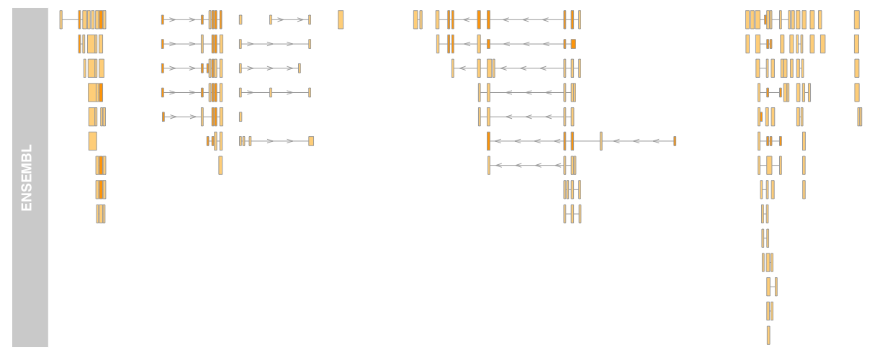

```{r setup, include=FALSE}
knitr::opts_chunk$set(echo = TRUE)
AsSlides <- TRUE
library(TxDb.Mmusculus.UCSC.mm10.knownGene)
library(GenomicAlignments)
library(DESeq2)
library(tximport)
library(org.Mm.eg.db)
library(goseq)
library(DEXSeq)
library(limma)
library(rtracklayer)
library(Gviz)
options(ucscChromosomeNames=FALSE)
```

##The Course 

 
 
* The Course 
* [Importance of Visualising Genomics Data](#/vizdata). 
* [Reminder of file types](#/filetypes) 
* [Reminder of data types](#/datatypes) 
* [Materials](#/materials) 
* [Visualising genomics data in R](#/VizinR) 
* [Plotting genome axis](#/genomeaxis) 
* [Plotting genome data](#/datatracks) 
* [Plotting genome annotation](#/Annotation) 
* [Plotting genome sequence](#/seqtrack) 
* [Plotting genomic alignments](#/genomeaxis) 
* [Plotting from external databases](#/externaldata) 

---
##Reminder of file types 

In this session we will be dealing with a range of data types. For more information on file types you can revisit our material. 
 
* [File Formats](https://rockefelleruniversity.github.io/Genomic_Data/). 
 
For more information on visualising genomics data in browsers you can visit our IGV course. 
 
* [IGV](https://rockefelleruniversity.github.io/IGV_course/). 
---
##Reminder of data types in Bioconductor 

We will also encounter and make use of many data structures and data types which we have seen throughout our courses on HTS data. You can revisit this material to refresh on HTS data analysis in Bioconductor and R below. 
 
* [Bioconductor](https://rockefelleruniversity.github.io/Bioconductor_Introduction/). 
* [Genomic Intervals](https://rockefelleruniversity.github.io/Bioconductor_Introduction/r_course/presentations/slides/GenomicIntervals_In_Bioconductor.html)
* [Genomic Scores](https://rockefelleruniversity.github.io/Bioconductor_Introduction/r_course/presentations/slides/GenomicScores_In_Bioconductor.html)
* [Sequences](https://rockefelleruniversity.github.io/Bioconductor_Introduction/r_course/presentations/slides/SequencesInBioconductor.html)
* [Gene Models](https://rockefelleruniversity.github.io/Bioconductor_Introduction/r_course/presentations/slides/GenomicFeatures_In_Bioconductor.html)
* [Alignments](https://rockefelleruniversity.github.io/Bioconductor_Introduction/r_course/presentations/slides/AlignedDataInBioconductor.html). 
* [ChIP-seq](http://rockefelleruniversity.github.io/RU_ChIPseq/). 
* [ATAC-seq](http://rockefelleruniversity.github.io/RU_ATACseq/). 
* [RNA-seq](http://rockefelleruniversity.github.io/RU_RNAseq/). 
 
 
 
---
##Materials. 

All material for this course can be found on github. 
* [Visualising Genomics Data](https://github.com/RockefellerUniversity/RU_VisualizingGenomicsData) 
 
Or can be downloaded as a zip archive from here.  
* [Download zip](https://github.com/RockefellerUniversity/RU_VisualizingGenomicsData/archive/master.zip) 

---
##Materials. - Presentations, source code and practicals. 

Once the zip file in unarchived. All presentations as HTML slides and pages, their R code and HTML practical sheets will be available in the directories underneath. 
 
* **viz_course/presentations/Slides/** 
Presentations as an HTML slide show. 
* **viz_course/presentations/exercises/** 
Some tasks/examples to work through.

---
##Materials. - Data for presentations, practicals. 

 
 
All data to run code in the presentations and in the practicals is available in the zip archive. This includes coverage as bigWig files, aligned reads as BAM files and genomic intervals stored as BED files. 
 
We also include some RData files containing precompiled results from querying database (in case of external server downtime).

All data can be found under the **Data** directory 
 
**Data/** 
 
---
##Set the Working directory 

 
 
Before running any of the code in the practicals or slides we need to set the working directory to the folder we unarchived.  
 
You may navigate to the unarchived VisualisingGenomicsData folder in the Rstudio menu 
 
**Session -> Set Working Directory -> Choose Directory** 
 
or in the console. 
 
```{r,eval=F}  
setwd("/PathToMyDownload/VisualizingGenomicsData/viz_course/presentations/Slides") 
# e.g. setwd("~/Downloads/VisualizingGenomicsData/viz_course/presentations/Slides") 
``` 
 
---
## Covered so far. (Making the axis)

We saw previously how we can create **GenomeAxisTrack** objects to represents scales and plot these using the **plotTracks()** functions.


```{r bbunny1, echo=T,eval=T,fig.width=5,fig.height=5,fig.align='center'} 
library(Gviz) 
genomeAxis <- GenomeAxisTrack(name="MyAxis") 
plotTracks(genomeAxis,from=100,to=10100) 
``` 

---
## Covered so far. (Adding data from GRanges/bigWigs)

We can create **DataTrack** objects from GRanges objects and plot these alongside our **GenomeAxisTrack** object using the **plotTracks()** functions.

```{r bbunny2, echo=T,eval=T,fig.width=10,fig.height=3,dependson="bbunny1",warning=FALSE} 
library(rtracklayer) 
allChromosomeCoverage <- import.bw("../../Data/activatedReads.bw",
                                   as="GRanges") 
accDT <- DataTrack(allChromosomeCoverage,chomosome="chr17") 
plotTracks(c(accDT,genomeAxis), 
           from=47504051,to=47600688, 
           chromosome="chr17",type="hist") 
```


---
## Covered so far. (Adding gene models to plots)

We created a **GeneRegionTrack** containing information on our gene models from our TxDb object and added this alongside data and axis to provide some context.

```{r bbunny3, echo=T,eval=T,fig.width=10,fig.height=3,dependson="bbunny2"}

library(TxDb.Mmusculus.UCSC.mm10.knownGene) 
customFromTxDb <- GeneRegionTrack(TxDb.Mmusculus.UCSC.mm10.knownGene,
                                  chromosome="chr17") 
plotTracks(c(accDT,customFromTxDb,genomeAxis), 
           from=47504051,to=47600688, 
           chromosome="chr17",type="hist") 
```


---
##SequenceTracks 
 
When displaying genomics data it can be important to illustrate the underlying sequence for the genome being viewed. 
 
Gviz uses **SequenceTrack** objects to handle displaying sequencing information. 
 
First we need to get some  sequence information for our genome of interest to display. Here we will use one of the **BSgenome** packages specific for hg19 - **BSgenome.Hsapiens.UCSC.hg19**. This contains the full sequence for hg19 as found in UCSC 
 
```{r, echo=TRUE} 
library(BSgenome.Hsapiens.UCSC.hg19) 
BSgenome.Hsapiens.UCSC.hg19[["chr7"]] 
``` 
---
##SequenceTracks - From a BSgenome object 

We can create a **SequenceTrack** object straight from this **BSgenome** object using the **SequenceTrack()** constructor.  
 
We can then plot this **SequenceTrack**, as with all tracks, using the **plotTracks()** functions. Here we specify the *from*, *to* and *chromosome* parameters to select a region to display. 
 
 
```{r, echo=TRUE,fig.width=20,fig.height=3} 
sTrack <- SequenceTrack(Hsapiens) 
plotTracks(sTrack,from=134887024,to=134887074, 
           chromosome = "chr7",cex=2.5) 
``` 
---
##SequenceTracks - From a DNAstringset object 


We can also specify a DNAstringset object which we have encountered in the [Bioconductor](https://rockefelleruniversity.github.io/Bioconductor_Introduction/r_course/presentations/slides/SequencesInBioconductor.html#1) courses. 
 
```{r, echo=T,fig.width=20,fig.height=3} 
dsSet <- DNAStringSet(Hsapiens[["chr7"]]) 
names(dsSet) <- "chr7" 
sTrack <- SequenceTrack(dsSet) 
plotTracks(sTrack,from=134887024,to=134887074, 
           chromosome = "chr7",cex=2.5) 
``` 
 
---
##SequenceTracks - From a DNAstringset object 

We can also create our custom SequenceTrack from a [Fasta](https://rockefelleruniversity.github.io/Genomic_Data/genomicFileFormats.html#/) file. 
 
Here we use an example containing only the sequence around the region we are looking at to save space. Since the sequence is only of the region of interest we need specify the sequence limits for the *from* and *to* arguments. With completer fasta files, **from** and **to** would be set as for other **SequenceTrack** examples. 
 
```{r, echo=F,eval=F} 
dsSet <- DNAStringSet(Hsapiens[["chr7"]]) 
tempSet <- DNAStringSet(dsSet[[1]][134887024:134887074]) 
names(tempSet) <- "chr7" 
writeXStringSet(tempSet,file="../../Data/chr7Short.fa") 
sTrack <- SequenceTrack("../../Data/chr7Short.fa") 
plotTracks(sTrack,from=1,to=50, 
           chromosome = "chr7") 
``` 
 
 
```{r, echo=T,eval=T,fig.width=20,fig.height=3} 
sTrack <- SequenceTrack("../../Data/chr7Short.fa") 
plotTracks(sTrack,from=1,to=50, 
           chromosome = "chr7",cex=3) 
``` 
---
##SequenceTracks - Displaying complement sequence 

 
 
As with IGV, the sequence can be displayed as its complement. This is performed here by setting the **complement** argument to the **plotTracks()** function to TRUE/T. 
 
```{r, echo=T,eval=T,fig.width=20,fig.height=3} 
sTrack <- SequenceTrack("../../Data/chr7Short.fa") 
plotTracks(sTrack,from=1,to=50, 
           chromosome = "chr7",complement=T,cex=3) 
``` 
---
##SequenceTracks - Displaying strand information 

 
 
We can also add 5' to 3' direction as we have for plotting **GenomeAxisTrack**  objects using the **add53** parameter. This allows for a method to illustrate the strand of the sequence being diplayed. 
 
```{r, echo=T,eval=T,fig.width=20,fig.height=3} 
sTrack <- SequenceTrack("../../Data/chr7Short.fa") 
plotTracks(sTrack,from=1,to=50, 
           chromosome = "chr7",complement=F, 
           add53=T,cex=2.5) 
``` 
---
##SequenceTracks - Displaying strand information 

 
 
Notice the 5' and 3' labels have swapped automatically when we have specified the complement sequence. 
 
```{r, echo=T,eval=T,fig.width=20,fig.height=2} 
sTrack <- SequenceTrack("../../Data/chr7Short.fa") 
plotTracks(sTrack,from=1,to=50, 
           chromosome = "chr7",complement=T, 
           add53=T,cex=2.5) 
``` 
---
##SequenceTracks - Controlling base display size 

 
 
We can control the size of bases with the **cex** parameter, as with the standard R plotting.  
 
An interesting feature of this is that when plotted bases overlap, Gviz will provide a colour representation of bases instead of the bases' characters. 
 
 
```{r, echo=T,collapse=T,fig.width=20,fig.height=2} 
plotTracks(sTrack,from=1,to=50, 
           chromosome = "chr7",cex=2.5) 
plotTracks(sTrack,from=1,to=50, 
           chromosome = "chr7", 
           cex=5) 
``` 

---
##SequenceTracks - Controlling base display size 

We can force the bases to be always a color representation instead of letter irrespective of **cex** by setting the **noLetters** parameter to **TRUE**.
 
```{r, echo=T,collapse=T,fig.width=20,fig.height=2} 
plotTracks(sTrack,from=1,to=50, 
           chromosome = "chr7",cex=1.1,noLetters=TRUE) 
``` 
---
##SequenceTracks - Controlling base display size 

If we want to colour bases by own colour scheme, we can provide a named vector of our desired colours to the fontcolor parameter.
 
```{r, echo=T,collapse=T,fig.width=20,fig.height=2} 
colForLetters <- c(A = "darkgrey", C = "red",
                    T = "darkgrey",G = "darkgrey")
plotTracks(sTrack,from=1,to=50, 
           chromosome = "chr7",cex=3,
           fontcolor=colForLetters) 
``` 

---
##AlignmentsTrack.  

So far we have displayed summarised genomics data using GRange objects or GRanges with associated metadata. 
 
A prominent feature of Gviz is that it can work with genomic alignments, providing methods to generate graphical summaries on the fly. 
 
Genomic alignments are stored in Gviz within the AlignmentsTrack object. 
 
Here we can read genomic alignments in from a BAM file, see our file formats course material, by specifying its location. 
 
 
```{r, echo=T,fig.width=20,fig.height=5} 
   peakReads <- AlignmentsTrack("../../Data/small_Sorted_SRR568129.bam") 
   peakReads 
``` 
---
##AlignmentsTrack.  Plotting Aligned Reads in Gviz 

The **AlignmentsTrack** object can be plotted in the same manner as tracks using **plotTracks()** function. 
 
Since the BAM file may contain information from all chromosomes we need to specify a chromsome to plot in the **chromosome** parameter and here we specify the **from** and **to** parameters too. 
 
```{r, echo=T,fig.width=20,fig.height=5} 
   plotTracks(peakReads, 
              chromosome="chr5", 
              from=135312577, 
              to=135314146) 
``` 
---
##AlignmentsTrack.  Plotting Aligned Reads in Gviz 

 
 
```{r, echo=T,fig.width=20,fig.height=5} 
   plotTracks(peakReads, 
              chromosome="chr5", 
              from=135312577, 
              to=135314146) 
``` 
 
 
By default **AlignmentTrack**s are rendered as both the reads themselves and the calculated coverage/signal depth from these reads. 
 
Reads, as with AnnotationTrack objects, show the strand of the aligned read by the direction of the arrow. 
---
##AlignmentsTrack.  Plotting Aligned Reads in Gviz 

 
 
The type of plot/plots produced can be controlled by the **type** argument as we have done for **DataTrack** objects. 
 
The valid types of plots for AlignmentsTrack objects are "pileup", "coverage" and "sashimi" *(We've come across sashimi plots before)*.  
 
The type "pileup" displays just the reads. 
 
```{r, echo=T,fig.width=20,fig.height=5} 
   plotTracks(peakReads, 
              chromosome="chr5", 
              from=135312577, 
              to=135314146, 
              type="pileup") 
``` 
---
##AlignmentsTrack.  Plotting Aligned Reads in Gviz 

 
 
The type "coverage" displays just the coverage (depth of signal over genomic positions) calculated from the genomic alignments. 
 
```{r, echo=T,fig.width=20,fig.height=5} 
   plotTracks(peakReads, 
              chromosome="chr5", 
              from=135312577, 
              to=135314146, 
              type="coverage") 
``` 
---
##AlignmentsTrack.  Plotting Aligned Reads in Gviz 

 
 
As we have seen the default display is a combination of "pileup" and "coverage". 
 
We can provide multiple *type* arguments to the **plotTracks()** function as a vector of valid types. The order in vector *here* does not affect the display order in panels. 
 
```{r, echo=T,fig.width=20,fig.height=4} 
   plotTracks(peakReads, 
              chromosome="chr5", 
              from=135312577, 
              to=135314146, 
              type=c("pileup","coverage")) 
``` 
 
 
---
##AlignmentsTrack.  Sashimi plots 

 
 
We have seen [sashimi plots in IGV](http://mrccsc.github.io/IGV_course/igv.html#/53) when reviewing RNA-seq data. 
 
Sashimi plots display the strength of signal coming from reads spanning splice junctions and so can act to illustrate changes in exon usage between samples. 
 
In IGV, we previous made use of the **BodyMap** data to show alternative splicing of an exon between heart and liver. 
 
<div align="center"> 
 
</div> 
---
##AlignmentsTrack.  Sashimi plots in Gviz 

 
 
To recapitulate this plot, we have retrieved the subsection of **BodyMap** data as BAM files. 
 
First we must create two **AlignmentsTrack** objects, one for each tissue's BAM file of aligned reads.  
 
In this case since we are working with paired-end reads we must specify this by setting the **isPaired** parameter to TRUE 
 
 
```{r aa, echo=T,fig.width=20,fig.height=5,cache=T} 
 
heartReads <- AlignmentsTrack("../../Data/heart.bodyMap.bam", 
                           isPaired = TRUE) 
liverReads <- AlignmentsTrack("../../Data/liver.bodyMap.bam",  
                           isPaired = TRUE) 
 
liverReads 
``` 
---
##AlignmentsTrack.  Sashimi plots in Gviz 

 
 
As with **DataTrack** objects we can combine the **AlignmentTrack**s as a vector for plotting with the **plotTracks()** function. 
 
By default we will display the reads and calculated coverage. Here the paired reads and split reads are illustrated by thick and thin lines respectively. 
 
```{r bb, echo=T,fig.width=20,fig.height=5,cache=T,dependson="aa"} 
plotTracks(c(heartReads,liverReads), 
           chromosome="chr12", 
           from=98986825,to=98997877) 
 
``` 
---
##AlignmentsTrack.  Sashimi plots in Gviz 

 
 
To reproduce a plot similar to that in IGV we can simply include the "sashimi" type in the **type** parameter vector, here alongside "coverage"  
 
```{r cc, echo=T,fig.width=20,fig.height=5,cache=T,dependson="bb"} 
plotTracks(c(heartReads,liverReads), 
           chromosome="chr12", 
           from=98986825, 
           to=98997877, 
           type=c("coverage","sashimi")) 
 
``` 
---
##AlignmentsTrack.  Highlighting genomic alignment information. 

 
 
The **AlignmentTrack** object allows for specific parameters controlling how reads are displayed to be passed to the **plotTracks()** function. 
 
A few useful parameters are **col.gaps** and **col.mates** or **lty.gap** and **lty.mates** which will allow us to better distinguish between gapped alignments (split reads) and gaps between read pairs respectively. 
 
 
```{r dd, echo=T,fig.width=18,fig.height=5,cache=T,dependson="cc"} 
plotTracks(c(liverReads), 
           chromosome="chr12", 
           from=98986825,to=98997877, 
           col.gap="Red",col.mate="Blue") 
``` 
---
##AlignmentsTrack.  Highlighting genomic alignment information. 

 
 
Similarly using lty.gap and lty.mate parameters.  
 
```{r ee, echo=T,fig.width=18,fig.height=5,cache=T,dependson="dd"} 
plotTracks(c(liverReads), 
           chromosome="chr12", 
           from=98986825,to=98997877, 
           lty.gap=2,lty.mate=1) 
 
``` 
 
Line width may also be controlled with lwd.gap and lwd.mate parameters continuing the similarities to Base R plotting. 
---
##AlignmentsTrack.  Highlighting mismatches to reference. 

 
 
A common purpose in visualising alignment data in broswers is review information relating to mismatches to the genome which may be related to SNPs. 
 
In order to highlight mismatches to the genome reference sequence we must first provide some information on the reference sequence. 
 
One method for this is to attach sequence information to the **AlignmentsTrack** itself by providing a **SequenceTrack** object to **referenceSequence** parameter in the **AlignmentsTrack()** constructor. Here we can create the **SequenceTrack** object ffor mouse. 
 
```{r aaas, echo=F,fig.width=18,fig.height=5,cache=T}
library(TxDb.Mmusculus.UCSC.mm10.knownGene) 
customFromTxDb <- GeneRegionTrack(TxDb.Mmusculus.UCSC.mm10.knownGene,
                                  chromosome="chr6") 
```
 

```{r ff, echo=T,fig.width=18,fig.height=5,cache=T,dependson="ee"} 
library(BSgenome.Mmusculus.UCSC.mm10)
sTrack <- SequenceTrack(BSgenome.Mmusculus.UCSC.mm10) 
activatedReads <- AlignmentsTrack("../../Data/activatedSNPread.bam", 
                           isPaired = TRUE, 
                           referenceSequence=sTrack) 
``` 
---
##AlignmentsTrack.  Highlighting mismatches to reference. 

 
Now when we can replot the pileup of reads where mismatches in the reads are highlighted. 

```{r gg, echo=T,fig.width=18,fig.height=5,cache=T,dependson=c("ff","aaas")} 
plotTracks(c(activatedReads,customFromTxDb), 
           chromosome="chr6", 
           from=124815373,to=124815412) 
  
``` 
---
##AlignmentsTrack.  Highlighting mismatches to reference. 

 
 
We could also specify the SequenceTrack in the **plotTracks()** function as shown for the liver reads example here. Here we simply include the relevant **SequenceTrack** object as a track to be plotted  alongside the BAM. 
 
```{r hh, echo=T,fig.width=18,fig.height=5,cache=T,dependson="gg"} 
plotTracks(c(activatedReads,sTrack), 
           chromosome="chr6", 
           from=124815373,to=124815412,cex=2) 
``` 
 

---
##Bringing in External data. 

**Gviz** has functions to allow us to import data from external repositories and databases. 
 
As in the IGV course, visualising genomics data in the context of additional genome information and external data held at these repositories provides a deeper insight into our own data. 
 
In this course we will look at two main methods of querying external databases- 
 
* The **BiomartGeneRegionTrack** object and constructor. 
* The **UcscTrack** object and constructor 
 
---
##Bringing in External data. Gene models through Biomart 

 
The **biomaRt** Bioconductor package to programatically query various [Biomarts](http://useast.ensembl.org/biomart/martview/07c68e326d8ee955472140d9da19b959). 
 
**Gviz** allows us to both query Biomarts and automatically create a GeneRegionTrack using the **BiomartGeneRegionTrack** objects and **BiomartGeneRegionTrack()** constructor. 
---
##Bringing in External data. Gene models through Biomart 

 
Here we construct a simple **BiomartGeneRegionTrack** object using the parameters to define locations of interest - "chromsome", "start","end","genome" as well as the Biomart to use, in this case Ensembl by setting the **name** parameter. 
 
```{r a, echo=T,fig.width=18,fig.height=5,cache=T} 
bgrTrack <- BiomartGeneRegionTrack(genome="hg19", 
                                   start=26591341, 
                                   end=27034958, 
                                   chromosome = "chr7", 
                                   name="ENSEMBL") 
``` 
---
##Bringing in External data. Gene models through Biomart 

We can then plot the BiomartGeneRegionTrack as we have previous GeneRegionTracks. 
 
```{r b, echo=T,fig.width=18,fig.height=5,cache=T,dependson="a"} 
plotTracks(bgrTrack) 
``` 

---
##Bringing in External data. Gene models through Biomart 

 
We can also specify filters in the **BiomartGeneRegionTrack()** constructor using the **filter** parameter. 
 
**Gviz** uses the **BiomaRt** Bioconductor package to query the Biomarts so we can review availble options using **BiomaRt's**  **useMart()** function to list available data collections and **listDatasets()** function to review all available datasets within the *ENSEMBL_MART_ENSEMBL* mart.
 
```{r c, echo=T,eval=FALSE,fig.width=10,fig.height=5,cache=T,dependson="b",warning=FALSE,message=FALSE} 
library(biomaRt)
martList <- listMarts()
mart = useMart("ENSEMBL_MART_ENSEMBL")
dataList <- listDatasets(mart)
mart = useMart("ENSEMBL_MART_ENSEMBL", dataset="hsapiens_gene_ensembl") 
filterList <- listFilters(mart)
``` 

---
##Bringing in External data. Gene models through Biomart 

 
Here we select only genes which have been annotated by both havana and ensembl (so called *Golden Transcripts*) 
 
```{r d, echo=T,eval=FALSE,fig.width=20,fig.height=5,cache=T,dependson="c"} 
bgrTrack <- BiomartGeneRegionTrack(genome="hg19", 
                                   start=26591341, 
                                   end=27034958, 
                                   chromosome = "chr7", 
                                   name="ENSEMBL",               
                                  filter=list(source="ensembl_havana")) 
``` 
---
##Bringing in External data. Gene models through Biomart 

 
Once we have retrieved our filtered gene models we can plot them as before. 

```{r dd1, echo=F,eval=T,cache=F} 
load("../../Data/ensembl_havana_encode.RData") 
``` 
 
 
```{r e, echo=T,eval=FALSE,fig.width=18,fig.height=5,cache=F} 
plotTracks(bgrTrack) 
``` 

<div align="center"> 
 
</div> 

---
##Bringing in External data. Tracks from UCSC 

 
 
A well known browser and source of genomic data and annotation is the [UCSC genome browser](https://genome.ucsc.edu/). **Gviz** can create track directly from UCSC tables using the functionality from **rtracklayer** Bioconductor package. 
 
The **Ucsctrack()** constructor and object allow for the query and track construction of a variety of data types. The **Ucsctrack()** function therefore requires us to specify the track type we expect using the **trackType** parameter as well as the required UCSC table using the **track** parameter.  
 
---
##Bringing in External data. Tracks from UCSC 

 
 
To understand which tables are available we can query the **rtracktables** package to identify track and table names. 
 
```{r a1, echo=T,fig.width=10,fig.height=5,cache=T} 
library(rtracklayer) 
session <- browserSession() 
genome(session) <- "hg19" 
trackNames(session) 
query <- ucscTableQuery(session, "Ensembl Genes", 
                        GRangesForUCSCGenome("hg19", "chr7", 
                                             IRanges(26591341,27034958))) 
tableNames(query) 
``` 
---
##Bringing in External data. Tracks from UCSC 

 
 
```{r b1, echo=T,fig.width=10,fig.height=5,cache=T,dependson="a1"} 
query <- ucscTableQuery(session, "Ensembl Genes", 
                        GRangesForUCSCGenome("hg19", "chr7", 
                                             IRanges(26591341,27034958))) 
tableNames(query) 

``` 
---
##Bringing in External data. Tracks from UCSC 

 
 
 
```{r c1, echo=T,eval=F,fig.width=10,fig.height=5,cache=T,dependson="b1"} 
ucscTrack <- UcscTrack(genome = "hg19", 
                       chromosome = "chr7", 
                       track = "ensGene", 
                       from = 26591341, 
                       to = 27034958, 
                       trackType = "GeneRegionTrack", 
                       rstarts = "exonStarts", 
                       rends = "exonEnds", 
                       gene ="name", 
                       symbol = "name2", 
                       transcript = "name", 
                       strand = "strand" 
) 
 
``` 
 
```{r d1, echo=F,eval=T,cache=T,dependson="c1"} 
load("../../Data/ensGene_UCSC.RData") 
``` 
To build the UCSC annotation as a **GeneRegionTrack** we must specify some information specific to **GeneRegionTrack** objects. This includes the "rstarts" and "rends". You can consult the help for **GeneRegionTrack()** (*?GeneRegionTrack to see from in R*) to see full parameters required for **UcscTrack** objects. 
---
##Bringing in External data. Tracks from UCSC 

 
 
Now we can compare the Ensembl gene builds from the two different sources.  
 
Notable differences in the annotation include the absense of some transcipts due to the additional filter applied in our **BiomartGeneRegionTrack** object creation. 
 
```{r e1, echo=T,fig.width=18,fig.height=5,cache=T,dependson="d1"} 
plotTracks(c(bgrTrack,ucscTrack), 
           from = 26591341,to = 27034958) 
``` 
 
---
##Bringing in External data. Tracks from UCSC as DataTrack 

 
 
By the same method we can take advantage of other types of UCSC data. 
 
In this example we capture the Conservation in the phyloP100wayAll table over and around our previously investigated ChIP-seq reads peak. 
 
Here we specify the data to be returned as a **DataTrack** object and the display type to be "hist". Here we are creating a **DataTrack** so would consult **DataTrack()** help *(?DataTrack)* to get full parameter list. 
 
```{r f1, eval=F,echo=T,fig.width=10,fig.height=5,cache=T,dependson="e1"} 
conservationTrack <- UcscTrack(genome = "hg19", chromosome = "chr5",track = "Conservation", table = "phyloP100wayAll",from = 135313003, to = 135313570, trackType = "DataTrack",start = "start", end = "end", data = "score",type = "hist", window = "auto", col.histogram = "darkblue",fill.histogram = "darkblue", ylim = c(-3.7, 4),name = "Conservation") 
 
``` 
 
---
##Bringing in External data. Tracks from UCSC as DataTrack 

 
 
With the inclusion of conservation alongside the coverage from CTCF peaks we can see a spike in conservation around the CTCF peak summit. We include a relative scale and increase the size of text for completeness. 
 
```{r g1, echo=F,eval=T,cache=T,dependson="f1"} 
load("../../Data/conservation.RData") 
``` 
 
```{r h1, echo=F,cache=T,dependson="g1"} 
genomeAxis <- GenomeAxisTrack(name="MyAxis",scale=250) 
``` 
 
```{r i1, echo=T,fig.width=18,fig.height=5,cache=T,dependson="h1"} 
plotTracks(c(conservationTrack,peakReads,genomeAxis), 
           from=135313003, 
           to=135313570, 
           chromosome = "chr5", 
           type = c("hist","coverage"), 
           sizes = c(1,1,0.2), 
           cex=2) 
``` 
 
---
##Exercises 

 
 
 
Time for exercises! [Link here](https://mrccsc.github.io/VisualisingGenomicsData/exercises/ExternalData_Exercises.html) 
 
---
##Solutions 

 
 
 
Time for solutions! [Link here](https://mrccsc.github.io/VisualisingGenomicsData/solutions/ExternalData_Solutions.html) 
 
 
 
