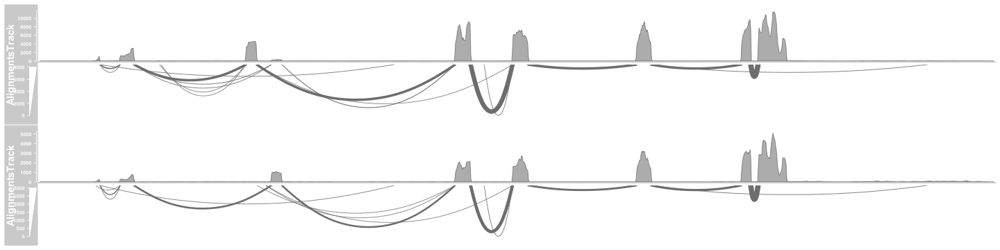
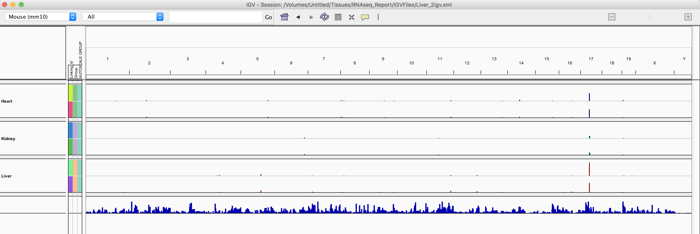
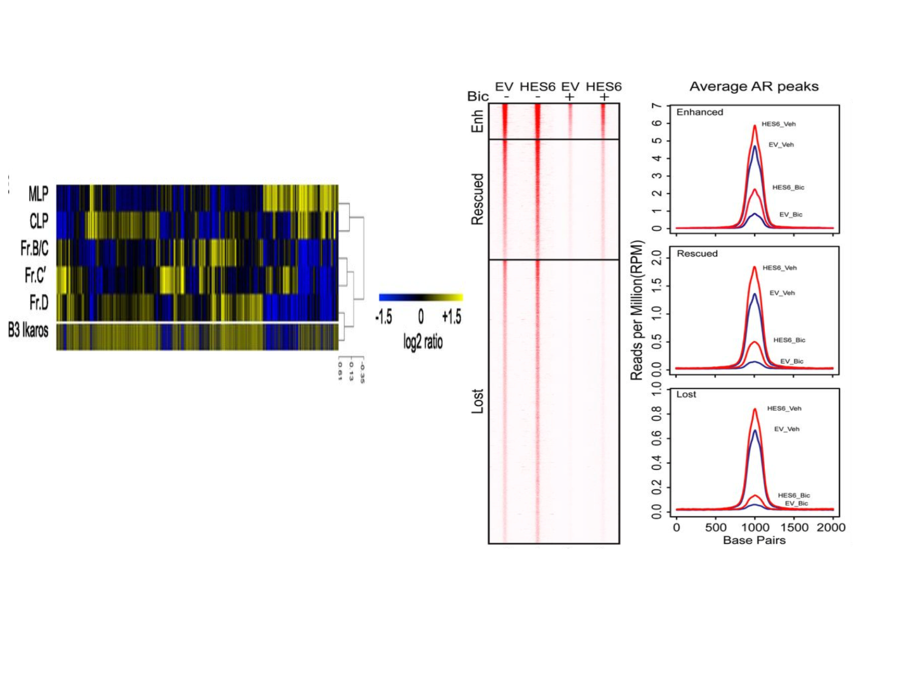
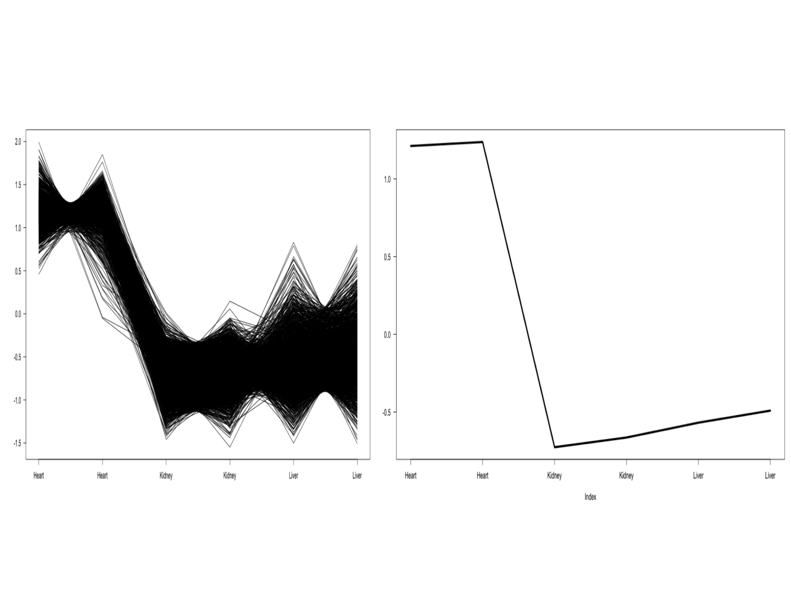

```{r setup, include=FALSE}
knitr::opts_chunk$set(echo = TRUE)
AsSlides <- TRUE
library(TxDb.Mmusculus.UCSC.mm10.knownGene)
library(GenomicAlignments)
library(DESeq2)
library(tximport)
library(org.Mm.eg.db)
library(goseq)
library(DEXSeq)
library(limma)
library(rtracklayer)
library(Gviz)
options(ucscChromosomeNames=FALSE)
```

##The Course 

 
 
* The Course.
* Visualising high-throughput data.
* Dimension reduction.
* PCA and loadings.
* Clustering.
* Grouping by kmeans.
* Testing gene clusters.

---
##Reminder of file types 

In this session we will be dealing with a range of data types. For more information on file types you can revisit our material. 
 
* [File Formats](https://rockefelleruniversity.github.io/Genomic_Data/). 

---
##Reminder of data types in Bioconductor 

We will also encounter and make use of many data structures and data types which we have seen throughout our courses on HTS data. You can revisit this material to refresh on HTS data analysis in Bioconductor and R below. 
 
* [Bioconductor](https://rockefelleruniversity.github.io/Bioconductor_Introduction/). 
* [Genomic Intervals](https://rockefelleruniversity.github.io/Bioconductor_Introduction/r_course/presentations/slides/GenomicIntervals_In_Bioconductor.html)
* [Genomic Scores](https://rockefelleruniversity.github.io/Bioconductor_Introduction/r_course/presentations/slides/GenomicScores_In_Bioconductor.html)
* [Sequences](https://rockefelleruniversity.github.io/Bioconductor_Introduction/r_course/presentations/slides/SequencesInBioconductor.html)
* [Gene Models](https://rockefelleruniversity.github.io/Bioconductor_Introduction/r_course/presentations/slides/GenomicFeatures_In_Bioconductor.html)
* [Alignments](https://rockefelleruniversity.github.io/Bioconductor_Introduction/r_course/presentations/slides/AlignedDataInBioconductor.html). 
* [ChIP-seq](http://rockefelleruniversity.github.io/RU_ChIPseq/). 
* [ATAC-seq](http://rockefelleruniversity.github.io/RU_ATACseq/). 
* [RNA-seq](http://rockefelleruniversity.github.io/RU_RNAseq/). 
 
 
 
---
##Materials. 

All material for this course can be found on github. 
* [Visualising Genomics Data](https://github.com/RockefellerUniversity/RU_VisualizingGenomicsData) 
 
Or can be downloaded as a zip archive from here.  
* [Download zip](https://github.com/RockefellerUniversity/RU_VisualizingGenomicsData/archive/master.zip) 

---
##Materials. - Presentations, source code and practicals. 

Once the zip file in unarchived. All presentations as HTML slides and pages, their R code and HTML practical sheets will be available in the directories underneath. 
 
* **viz_course/presentations/Slides/** 
Presentations as an HTML slide show. 
* **viz_course/presentations/exercises/** 
Some tasks/examples to work through.

---
##Materials. - Data for presentations, practicals. 

 
 
All data to run code in the presentations and in the practicals is available in the zip archive. This includes coverage as bigWig files, aligned reads as BAM files and genomic intervals stored as BED files. 
 
We also include some RData files containing precompiled results from querying database (in case of external server downtime).

All data can be found under the **Data** directory 
 
**Data/** 
 
---
##Set the Working directory 

 
 
Before running any of the code in the practicals or slides we need to set the working directory to the folder we unarchived.  
 
You may navigate to the unarchived VisualisingGenomicsData folder in the Rstudio menu 
 
**Session -> Set Working Directory -> Choose Directory** 
 
or in the console. 
 
```{r,eval=F}  
setwd("/PathToMyDownload/VisualizingGenomicsData/viz_course/presentations/Slides") 
# e.g. setwd("~/Downloads/VisualizingGenomicsData/viz_course/presentations/Slides") 
``` 
 
---
## Covered so far. (Vizualising genomic locations)

Previously we have reviewed how we can review signal and annotation over individual sites using and genome browser such as IGV and or programmatically using Gviz.

.pull-left[

]

.pull-right[

]


---
## Vizualising high dimensional Biological data.

With many high throughput sequencing experiments we are able to gain a genome wide view of our assays (in RNA-seq we measure every gene's expression, in ChIP-seq we identify all events for a user-defined transcription factor/mark, in ATAC-seq we evaluate all open/accessible regions in the genome.)
 


 
```{r a,eval=F}  

``` 

---
## Vizualising high dimensional Biological data.

Common techniques used to visualise genomics data include dimension reduction and/or clustering followed by the graphical representation of data as a heatmap.

These techniques allows us to better identify patterns within our data such as reproducibility of replicates within groups and magnitude of changes in signal between groups.

<div align="center">

</div>

---
## Vizualising high dimensional Biological data.

In todays session we will work with some of the RNA-seq data of adult mouse tissues from Bing Ren's lab, Liver and Heart. 
- More information on liver data [can be found here ](https://www.encodeproject.org/experiments/ENCSR000CHB/)
- More information on heart data [can be found here ](https://www.encodeproject.org/experiments/ENCSR000CGZ/)
- More information on Kidney data [can be found here ](https://www.encodeproject.org/experiments/ENCSR000CGZ/)


This represent a more complex experimental design than the two group comparison performed between activated and naive t-cells and so we will use some clustering and dimensional reduction tecniques to interrogate this data.


---
## Counts from SummariseOverlaps

In our RNAseq session we counted our reads in genes using the summarise overlaps function to generate our **RangedSummarizedExperiment** object.

First we create our BamFileList object to control memort usage.

```{r eval=FALSE,echo=TRUE}
library(Rsamtools)
bamFilesToCount <- c("Sorted_Heart_1.bam","Sorted_Heart_2.bam",
                     "Sorted_Kidney_1.bam","Sorted_Kidney_2.bam",
                     "Sorted_Liver_1.bam","Sorted_Liver_2.bam")
myBams <- BamFileList(bamFilesToCount,yieldSize = 10000)

```

---
## Counts from SummariseOverlaps

With this BamFileList we can summarise from BAMs to produce our **RangedSummarizedExperiment** object of counts in genes across all samples.  

We add in some metadata information for use with DESeq2 to our object with the **colData()** function.

```{r eval=FALSE,echo=TRUE}
library(TxDb.Mmusculus.UCSC.mm10.knownGene)
library(GenomicAlignments)
geneExons <- exonsBy(TxDb.Mmusculus.UCSC.mm10.knownGene,by="gene")
geneCounts <- summarizeOverlaps(geneExons,myBams,
                                    ignore.strand = TRUE)
colData(geneCounts)$tissue <- c("Heart", "Heart","Kidney","Kidney","Liver","Liver") 
```

```{r gC1,eval=TRUE,echo=FALSE,cache=TRUE,warning=FALSE,message=FALSE}
load("../../Data/gC_TissueFull.RData")
geneCounts <- geneCounts_Tissue
colData(geneCounts)$Tissue <- c("Heart", "Heart","Kidney","Kidney","Liver","Liver") 
geneCounts <- geneCounts[rowSums(assay(geneCounts)) > quantile(rowSums(assay(geneCounts)),0.4)]
```

---
## DESeq2

From here we can  **DESeqDataSet()** function to build directly from our **RangedSummarizedExperiment** object specifying the  metadata column to test on to the **design** parameter.

We then use the **DESeq()** fuction to normalise, fit variance, remove outliers and we extract comparisons of interest using the **results()** function. 

```{r gD,eval=TRUE,echo=TRUE,cache=TRUE,dependson="gC1",warning=FALSE,message=FALSE}
dds <- DESeqDataSet(geneCounts,design = ~Tissue)
dds <- DESeq(dds)
heartVsLiver <- results(dds,c("Tissue","Heart","Liver"))
heartVskidney <- results(dds,c("Tissue","Heart","Kidney"))
LiverVskidney <- results(dds,c("Tissue","Liver","Kidney"))
```

---
## DESeq2

Further to our pair-wise comparisons we can extract an anova-like statistic identifying genes changing expression between conditions using the *LRT* test with our reduced model (no groups model).

```{r gDA,eval=TRUE,echo=TRUE,cache=TRUE,dependson="gd",warning=FALSE,message=FALSE}
dds2 <- DESeq(dds,test="LRT",reduced = ~1)
AllChanges <- results(dds2)
```

---
## Visualizing RNAseq data.

One of the first steps of working with count data for visualisation is commonly to transform the integer count data to log2 scale.

To do this we will need to add some artifical value (pseudocount) to zeros in our counts prior to log transform (since the log2 of zero is infinite). 

The DEseq2 **normTransform()** will add a 1 to our normalised counts prior to log2 transform and return a **DESeqTransform** object.

```{r gnT,eval=TRUE,echo=TRUE,cache=TRUE,dependson="gDA",warning=FALSE,message=FALSE}
normLog2Counts <- normTransform(dds)
normLog2Counts
```

---
## Visualizing RNAseq data.

We can extract our normalised and transformed  counts from the **DESeqTransform** object using the **assay()** function.

```{r gnTM,eval=TRUE,echo=TRUE,cache=TRUE,dependson="gnT",warning=FALSE,message=FALSE,fig.height=4,fig.width=7}
matrixOfNorm <- assay(normLog2Counts)
boxplot(matrixOfNorm)
```

---
## Visualizing RNAseq data.

When visualising our signal however we now will have a similar problem with smaller counts having higher variance. This may cause changes in smaller counts to have undue influence in visualisation and clustering.

```{r gnTMP,eval=TRUE,echo=TRUE,cache=TRUE,dependson="gnTM",warning=FALSE,message=FALSE,fig.height=4,fig.width=7}
library(vsn)
meanSdPlot(matrixOfNorm)
```


---
## Visualizing RNAseq data.

We can apply an **rlog** transformation to our data using the **rlog()** function which will attempt to shrink the variance for genes based on their mean expression.

```{r gRL,eval=TRUE,echo=TRUE,cache=TRUE,dependson="gD",warning=FALSE,message=FALSE}
rlogTissue <- rlog(dds)
rlogTissue
```

---
## Visualizing RNAseq data.

Again we can extract the matrix of transformed counts with the **assay()** function and plot the mean/variance relationship. Here we can see the shrinkage of variance for low count genes. 


```{r gRLM,eval=TRUE,echo=TRUE,cache=TRUE,dependson="gRL",warning=FALSE,message=FALSE,fig.height=4,fig.width=7}
rlogMatrix <- assay(rlogTissue)
meanSdPlot(rlogMatrix)
```

---
## Dimension reduction.

Since we have often have measured 1000s of genes over multiple samples/groups we will often try and simplify this too a few dimensions or meta/eigen genes which represent major patterns of signal across samples found.

We hope the strongest patterns or sources of variation in our data are correlated with sample groups and so dimention reduction offers a methods to method to visually identify reproducibity of samples.

Common methods of dimention reduction include Principal Component Analysis, MultiFactorial Scaling and Non-negative Matrix Factorization.

<div align="center">

</div>

---
## PCA

We can see PCA in action with our data simply by using the DESeq2's **plotPCA()** function and our **DESeqTransform** object from our rlog transformation.

We must also provide a metadata column to colour samples by to the **intgroup** parameter and we set the **ntop** parameter to use all genes in PCA (by default it is top 500).


```{r gPCA,eval=TRUE,echo=TRUE,cache=TRUE,dependson="gRLM",warning=FALSE,message=FALSE,fig.height=3,fig.width=7}
plotPCA(rlogTissue,
        intgroup="Tissue",
        ntop=nrow(rlogTissue))
```

---
## PCA

This PCA show the separation of samples by their group and the localisation of samples with groups.

Since PC1 here explains 51% of total variances amongst samples and PC2 explains 44%, the reduction of dimensions can be seen to explain much of the changes among samples in 2 dimenstions.

Of further note is the separation of samples across PC1 but the lack of separation of Heart and Kidney samples along PC2.

```{r gPCA3,eval=TRUE,echo=FALSE,cache=TRUE,dependson="gRLM",warning=FALSE,message=FALSE,fig.height=4,fig.width=7}
plotPCA(rlogTissue,
        intgroup="Tissue",
        ntop=nrow(rlogTissue))
```

---
## PCA

PCA is often used to simply visualise sample similarity but we can extract further information of the patterns of expression corresponding PCs by performing the PCA analysis ourselves.

We can use the **prcomp()** function with a transposition of our matrix to perform our prinicipal component analysis. The mappings of samples to PCs can be found in the **x** slot of the **prcomp** object.

```{r gPRcomp,eval=TRUE,echo=TRUE,cache=TRUE,dependson="gRLM",warning=FALSE,message=FALSE}
pcRes <- prcomp(t(rlogMatrix))
class(pcRes)
pcRes$x[1:2,]
```

---
## PCA

We can now reproduce the previous plot from DEseq2 in basic graphics from this.

```{r gPRcosmp,eval=TRUE,echo=TRUE,cache=TRUE,dependson="gPRcomp",warning=FALSE,message=FALSE,fig.height=4,fig.width=7}
plot(pcRes$x,
     col=colData(rlogTissue)$Tissue,
     pch=20,
     cex=2)
legend("top",legend = c("Heart","Kidney","Liver"),
       fill=unique(colData(rlogTissue)$Tissue))
```

---
## PCA

Now we have constucted the PCA ourselves we can investigate which genes' expression profiles influence the relative PCs.

The influence (rotation/loadings) for all genes to each PC can be found in the **rotation** slot of the **prcomp** object.

```{r gPRloading,eval=TRUE,echo=TRUE,cache=TRUE,dependson="gPRcomp",warning=FALSE,message=FALSE}
pcRes$rotation[1:5,1:4]
```
---
## PCA

To investigate the seperation of Kidney samples along the negative axis of PC2 i can then look at which genes most negatively contribute to PC2.

Here we order by the most negative values for PC2 and select the top 100


```{r gPRload2,eval=TRUE,echo=TRUE,cache=TRUE,dependson="gPRcomp",warning=FALSE,message=FALSE}
PC2markers <- sort(pcRes$rotation[,2],decreasing = FALSE)[1:100]
PC2markers[1:10]
```

---
## PCA

To investigate the gene expression profiles associated with PC2 we can now plot the log2 foldchanges ( or directional statistics) from our pairwise comparisons for our PC2 most influencial genes.

From the boxplot it is clear to see that the top100 genes are all specifically upregulated in Kidney tissue.

```{r gPRcompRot,eval=TRUE,echo=TRUE,cache=TRUE,dependson="gPRcomp",warning=FALSE,message=FALSE,fig.height=4,fig.width=7}
PC2_hVsl <- heartVsLiver$stat[rownames(heartVsLiver) %in% names(PC2markers)]
PC2_hVsk <- heartVskidney$stat[rownames(heartVskidney) %in% names(PC2markers)]
PC2_LVsk <- LiverVskidney$stat[rownames(LiverVskidney) %in% names(PC2markers)]

```


```{r gPRcompRot2,eval=FALSE,echo=FALSE,cache=TRUE,dependson="gPRcomp",warning=FALSE,message=FALSE}
PC1markers <- sort(pcRes$rotation[,1],decreasing = FALSE)[1:100]
PC1_hVsl <- heartVsLiver$stat[rownames(heartVsLiver) %in% names(PC1markers)]
PC1_hVsk <- heartVskidney$stat[rownames(heartVskidney) %in% names(PC1markers)]
PC1_LVsk <- LiverVskidney$stat[rownames(LiverVskidney) %in% names(PC1markers)]
boxplot(PC1_hVsl,PC1_hVsk,PC1_LVsk,names=c("HeartVsLiver","HeartVsKidney","LiverVsKidney"))
```

```{r gPRcompRot3,eval=FALSE,echo=FALSE,cache=TRUE,dependson="gPRcomp",warning=FALSE,message=FALSE}
PC1markers <- sort(pcRes$rotation[,1],decreasing = TRUE)[1:100]
PC1_hVsl <- heartVsLiver$stat[rownames(heartVsLiver) %in% names(PC1markers)]
PC1_hVsk <- heartVskidney$stat[rownames(heartVskidney) %in% names(PC1markers)]
PC1_LVsk <- LiverVskidney$stat[rownames(LiverVskidney) %in% names(PC1markers)]
boxplot(PC1_hVsl,PC1_hVsk,PC1_LVsk,names=c("HeartVsLiver","HeartVsKidney","LiverVsKidney"))
```

---
## PCA

From the boxplot it is clear to see that the top100 genes are all specifically upregulated in Kidney tissue.

```{r gPRcompRotf,eval=TRUE,echo=TRUE,cache=TRUE,dependson="gPRcompRot",warning=FALSE,message=FALSE,fig.height=4,fig.width=7}
boxplot(PC2_hVsl,PC2_hVsk,PC2_LVsk,
        names=c("HeartVsLiver","HeartVsKidney","LiverVsKidney"))
```

---
## Sample-to-Sample correlation

Another common step in quality control is to assess the correlation between expression profiles of samples.

We can assess correlation between all samples in a matrix by using the **cor()** function.

```{r gSampleDista,eval=TRUE,echo=TRUE,cache=TRUE,dependson="gPRcomp",warning=FALSE,message=FALSE}
sampleCor <- cor(rlogMatrix)
sampleCor
```

---
## Sample-to-Sample correlation

We can visualise the the correlation matrix using a heatmap following sample clustering.

First we need to convert our correlation matrix into a distance measure to be use in clustering by subtracting from 1 to give dissimilarity measure and converting with the **as.dist()** to a **dist** object. 

We then create a matrix of distance values to plot in the heatmap from this using **as.matrix()** function.


```{r gSampleDistb,eval=TRUE,echo=TRUE,cache=TRUE,dependson="gSampleDista",warning=FALSE,message=FALSE}
library(pheatmap)
sampleDists <- as.dist(1-cor(rlogMatrix))
sampleDistMatrix <- as.matrix(sampleDists)

```

---
## Sample-to-Sample correlation

We can use the **pheatmap** library's pheatmap function to cluster our data by similarity and produce our heatmaps. We provide our matrix of sample distances as well as our **dist** object to the **clustering_distance_rows** and **clustering_distance_cols** function.

By default hierarchical clustering will group samples based on their gene expression similarity into a dendrogram with between sample similarity illustrated by branch length. 

```{r gSampleDistc,eval=TRUE,echo=TRUE,cache=TRUE,dependson="gSampleDistb",warning=FALSE,message=FALSE,fig.height=4,fig.width=7}
pheatmap(sampleDistMatrix,
         clustering_distance_rows=sampleDists,
         clustering_distance_cols=sampleDists)
```

---
## Sample-to-Sample correlation


We can use the **brewer.pal** and **colorRampPalette()** function to create a white to blue scale [as we have with **ggplot** scales](https://rockefelleruniversity.github.io/Plotting_In_R/r_course/presentations/slides/ggplot2.html#60).

```{r gSampleDistca,eval=TRUE,echo=TRUE,cache=TRUE,dependson="gSampleDistb",warning=FALSE,message=FALSE,fig.height=3,fig.width=7}
library(RColorBrewer)
blueColours <- brewer.pal(9, "Blues")
colors <- colorRampPalette(rev(blueColours))(255)
plot(1:255,rep(1,255),
     col=colors,pch=20,cex=20,ann=FALSE,
     yaxt="n")

```

---
## Sample-to-Sample correlation

We can provide a slightly nicer scale for our distance measure heatmap to the **color** parameter in the **pheatmap** function.

```{r gSampleDistd,eval=TRUE,echo=TRUE,cache=TRUE,dependson="gSampleDistca",warning=FALSE,message=FALSE,fig.height=4,fig.width=7}
pheatmap(sampleDistMatrix,
         clustering_distance_rows=sampleDists,
         clustering_distance_cols=sampleDists,
         color = colors)
```

---
## Sample-to-Sample correlation

Finally we can add some column annotation to highlight group membership. We must provide annotation as a data.frame of metadata we wish to include with rownames matching column names.

Fortunetely that is exactly as we have set up from DEseq2. We can extract metadata from the DESeq2 object with **colData()** function  and provide to the **annotation_col** parameter.
```{r gSampleDiste,eval=FALSE,echo=TRUE,cache=TRUE,dependson="gSampleDistc",warning=FALSE,message=FALSE,fig.height=3,fig.width=7}
annoCol <- as.data.frame(colData(dds))
pheatmap(sampleDistMatrix,
         clustering_distance_rows=sampleDists,
         clustering_distance_cols=sampleDists,
         color = colors,annotation_col = annoCo)
```

```{r gSampleDistl,eval=TRUE,echo=FALSE,cache=TRUE,dependson="gSampleDistc",warning=FALSE,message=FALSE,fig.height=3,fig.width=7}
annoCol <- as.data.frame(colData(dds))
pheatmap(sampleDistMatrix,
         clustering_distance_rows=sampleDists,
         clustering_distance_cols=sampleDists,
         color = colors,annotation_col = annoCol[,1,drop=FALSE])
```

---
## Clustering genes and samples.

We can use the same methods of clustering samples to cluster genes with similiar expression patterns together.

Clustering genes will allow us to visually identify the major patterns of gene expressions with our data and to group genes with similar expression profiles for review and functional analysis.

This technique will hopefully allow us to distentangle the complex sets of comparison found in evaluating significant differences found from our DESeq2 LRT test of changes in genes' expression between any tissue.

First then lets subset our rlog transformed gene expression matrix to those genes significant in our LRT test. 

```{r he1,eval=TRUE,echo=TRUE,cache=TRUE,dependson=c("gRLM","gDA"),warning=FALSE,message=FALSE}
sigChanges <- rownames(AllChanges)[AllChanges$padj < 0.01 & !is.na(AllChanges$padj)]
sigMat <- rlogMatrix[rownames(rlogMatrix) %in% sigChanges,]
nrow(sigMat)
```

---
## Clustering genes and samples

We can pass our filtered matrix of expression to the **pheatmap()** function and set the **scale** parameter to *row* to allow for clustering of relative changes in gene expression.

Additionally due to the large number of genes, we turn rowname off with the **show_rownames** function.

```{r he2,eval=TRUE,echo=TRUE,cache=TRUE,dependson="gPRcomp",warning=FALSE,message=FALSE,dependson=c("he1"),fig.height=3,fig.width=7}
library(pheatmap)
pheatmap(sigMat,
         scale="row",
         show_rownames = FALSE)
```


---
## Clustering genes and samples

```{r he2a,eval=TRUE,echo=TRUE,cache=TRUE,dependson="gPRcomp",warning=FALSE,message=FALSE,dependson=c("he1"),fig.height=6,fig.width=7}
library(pheatmap)
pheatmap(sigMat,
         scale="row",
         show_rownames = FALSE)
```


---
## Clustering genes and samples

Now we have a visual representation of changes in gene expression across samples we can use the clustering to derive groups of genes with similar expression patterns. Gene with similar expression profiles may share functional roles and so we can use these groups to further evaluate our gene expression data.

Many approaches to identifying clustered groups of genes exist including K-means, SOM and HOPACH.

K-means is implemented with the pheatmap package and so we can simply provide a desired number of clusters to the **kmeans_k** parameter. 

```{r km1,eval=FALSE,echo=TRUE,cache=TRUE,dependson="he2",warning=FALSE,message=FALSE}
library(pheatmap)
set.seed(153)
k <-   pheatmap(sigMat,
           scale="row",kmeans_k = 7)
```

---
## Clustering genes and samples

The resulting plot no longer shows our individual genes but the average relative expression of genes within a cluster. 

The heatmap rownames show the cluster name and importantly the number of genes within each cluster.

```{r km2,eval=TRUE,echo=TRUE,cache=TRUE,dependson="km1",warning=FALSE,message=FALSE,fig.height=4,fig.width=7}
library(pheatmap)
set.seed(153)
k <-   pheatmap(sigMat,
           scale="row",kmeans_k = 7)
```

---
## Clustering genes and samples

The **pheatmap()** function returns information on clustering is return as a list and following k-means clustering the assignment of genes to clusters can be extracted from this.

```{r km3,eval=TRUE,echo=TRUE,cache=TRUE,dependson="km2",warning=FALSE,message=FALSE}
names(k$kmeans)
clusterDF <- as.data.frame(factor(k$kmeans$cluster))
colnames(clusterDF) <- "Cluster"
clusterDF[1:10,,drop=FALSE]
```

---
## Clustering genes and samples

We can now plot our full heatmap highlighting the membership of genes to clusters.

We add an additional row annotation by providing a data.frame of desired annotation with rownames matching between our annotation data.frame and our rlog  transformed matrix to the **annotation_row** parameter.

```{r km4,eval=FALSE,echo=TRUE,cache=TRUE,dependson="km3",warning=FALSE,message=FALSE}
OrderByCluster <- sigMat[order(clusterDF$Cluster),]

pheatmap(OrderByCluster,
           scale="row",annotation_row = clusterDF,
           show_rownames = FALSE,cluster_rows = FALSE)

```

---
## Clustering genes and samples

```{r km4r,eval=TRUE,echo=TRUE,cache=TRUE,dependson="km3",warning=FALSE,message=FALSE,fig.height=5,fig.width=7}
OrderByCluster <- sigMat[order(clusterDF$Cluster),]

pheatmap(OrderByCluster,
           scale="row",annotation_row = clusterDF,
           show_rownames = FALSE,cluster_rows = FALSE)

```
---
## Testing gene clusters

Now we have some genes clusters from our expression data, we will want to invesitigate these clusters for any enrichment of fucntional terms within them.

Here we extract all genes in cluster 1, which appear to be our heart specific genes,

```{r km5,eval=TRUE,echo=TRUE,cache=TRUE,dependson="km4",warning=FALSE,message=FALSE}
heartSpecific <- rownames(clusterDF[clusterDF$Cluster == 1,,drop=FALSE])
heartSpecific[1:10]
```

---
## Testing gene clusters

We can now build our logical vector of all genes ( from those with Padj values from LRT test) with the genes in cluster marked as TRUE. 

We will use the logical vector for geneset testing using **goseq**.

```{r km6,eval=TRUE,echo=TRUE,cache=TRUE,dependson="km5",warning=FALSE,message=FALSE}
bckGround <- rownames(AllChanges)[!is.na(AllChanges$padj)]
heartSpecific <- bckGround %in% heartSpecific
names(heartSpecific) <- bckGround
heartSpecific[1:10]
```

---
## Testing gene clusters


We can now pass our named logical vector to the **nullp** and **goseq** function seen before in geneset testing in RNAseq and ChIPseq. Here we test against the GO Biological Processes genesets.

```{r km7,eval=TRUE,echo=TRUE,cache=TRUE,dependson="km6",warning=FALSE,message=FALSE,fig.height=5,fig.width=7}
library(goseq)
toTest <- nullp(heartSpecific,"mm10",id = "knownGene")

```

---
## Testing gene clusters

From our GO test we can see enrichment for some heart specific terms such as *muscle development*.


```{r km8,eval=TRUE,echo=TRUE,cache=TRUE,dependson="km7",warning=FALSE,message=FALSE}
heartRes <- goseq(toTest,"mm10","knownGene",test.cats = "GO:BP")
heartRes[1:5,]
```


---
## PCA

Finally we can use our heatmaps to get a better idea of the pattern of expression associated with PC1 plot we saw earlier.

```{r gPCACM,eval=TRUE,echo=TRUE,cache=TRUE,dependson="gPCAC",warning=FALSE,message=FALSE,fig.height=4,fig.width=7}
plotPCA(rlogTissue,
        intgroup="Tissue",
        ntop=nrow(rlogTissue))
```

---
## PCA

We can extract and sort our expression matrix by the loadings (influence) of genes on PC1.

Here we use the **match()** fucntion to sort our rlog transformed gene expression matrix to the order of PC1 influence

```{r gPCACk,eval=TRUE,echo=TRUE,cache=TRUE,dependson="gPCACM",warning=FALSE,message=FALSE}
PC1_rnk <- sort(pcRes$rotation[,1],decreasing = TRUE)
PC1_mat <- sigMat[match(names(PC1_rnk),rownames(sigMat),nomatch = 0),]
PC1_mat[1:3,]
```

---
## PCA

Now we plot our heatmap of gene expression ordered by PC1 influence to reveal the PC1's epression profile.

```{r gPCACkl,eval=FALSE,echo=TRUE,cache=TRUE,dependson=c("gPCACk","gSampleDistl"),warning=FALSE,message=FALSE,fig.height=5,fig.width=7}
pheatmap(PC1_mat,
         scale="row",
         cluster_rows=FALSE,
         show_rownames = FALSE,annotation_col = annoCol
         )
```

```{r gPCACk333,eval=TRUE,echo=FALSE,cache=TRUE,dependson=c("gPCACk","gSampleDistl"),warning=FALSE,message=FALSE,fig.height=5,fig.width=7}
pheatmap(PC1_mat,
         scale="row",
         cluster_rows=FALSE,
         show_rownames = FALSE,annotation_col = annoCol[,1,drop=FALSE]
         )
```


---
##Exercises 

 
Time for exercises! [Link here](../../Exercises/Viz_part3_exercises.html) 
 
---
##Solutions 

 
Time for solutions! [Link here](../../Answers/Viz_part3_answers.html) 
 

 
 
