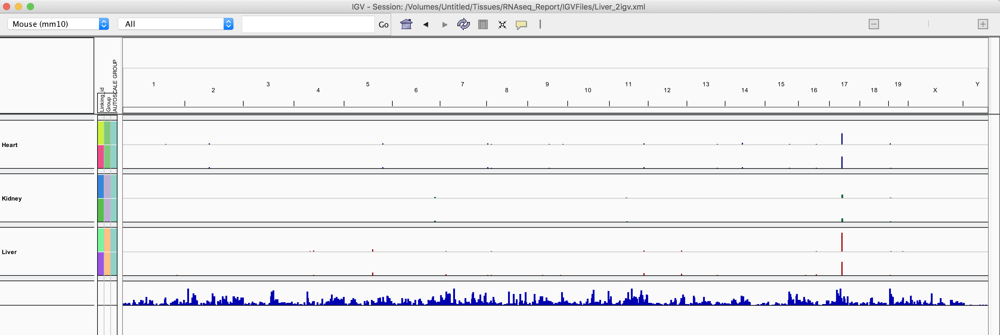
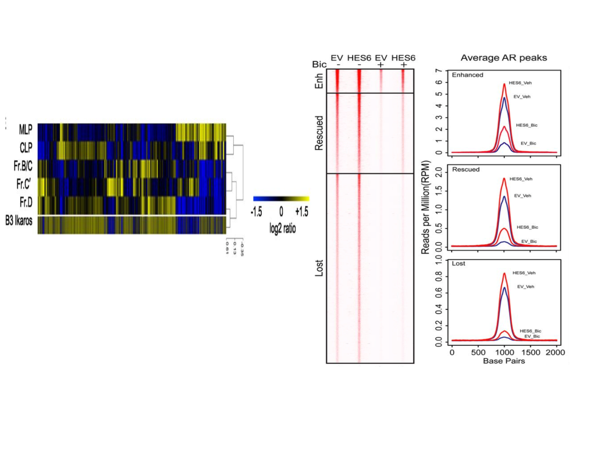

```{r setup, include=FALSE}
knitr::opts_chunk$set(echo = TRUE)
AsSlides <- TRUE
library(TxDb.Mmusculus.UCSC.mm10.knownGene)
library(GenomicAlignments)
library(DESeq2)
library(tximport)
library(org.Mm.eg.db)
library(goseq)
library(DEXSeq)
library(limma)
library(rtracklayer)
library(MotifDb)
library(Biostrings)
library(seqLogo)
library(BSgenome.Mmusculus.UCSC.mm10)
library(Gviz)
options(ucscChromosomeNames=FALSE)
```


```{r setup2, include=FALSE,eval=FALSE}
knitr::opts_chunk$set(echo = TRUE)
AsSlides <- TRUE
library(TxDb.Mmusculus.UCSC.mm10.knownGene)
library(GenomicAlignments)
library(DESeq2)
library(tximport)
library(org.Mm.eg.db)
library(goseq)
library(DEXSeq)
library(limma)
library(rtracklayer)
library(Gviz)
options(ucscChromosomeNames=FALSE)


library(soGGi)
library(rtracklayer)

library(soGGi)
library(rtracklayer)
library(TxDb.Mmusculus.UCSC.mm10.knownGene)
dsds <- genes(TxDb.Mmusculus.UCSC.mm10.knownGene)
names(dsds) <- NULL
csc41 <- regionPlot(bamFile = "~/Downloads/ENCFF239XXP.bigWig",testRanges = dsds,style = "percentOfRegion",format = "bigwig")
plotRegion(csc41)

myMatt <- matt[!dwdw,]
plot <- pheatmap::pheatmap(myMatt,scale="none",kmeans_k = 2,cluster_cols = FALSE,useRaster=TRUE)
library(gplots)
library(pheatmap) 

pheatmap(myMatt[order(plot$kmeans$cluster),][1:20,],cluster_rows = FALSE,cluster_cols =FALSE,scale="none",
          ,useRaster=FALSE)


heatmap.2(myMatt[order(plot$kmeans$cluster),], Rowv=FALSE, Colv=FALSE, useRaster=TRUE, labRow=NA, symbreaks=TRUE, breaks=51,
           col="redblue", trace="none", key=FALSE)

```


##The Course 


 
* The Course.
* Visualising high-throughput data.
* Plotting ChIPseq data.
* Plotting Motifs occurrence


---
##Reminder of file types 

In this session we will be dealing with a range of data types. For more information on file types you can revisit our material. 
 
* [File Formats](https://rockefelleruniversity.github.io/Genomic_Data/). 

---
##Reminder of data types in Bioconductor 

We will also encounter and make use of many data structures and data types which we have seen throughout our courses on HTS data. You can revisit this material to refresh on HTS data analysis in Bioconductor and R below. 
 
* [Bioconductor](https://rockefelleruniversity.github.io/Bioconductor_Introduction/). 
* [Genomic Intervals](https://rockefelleruniversity.github.io/Bioconductor_Introduction/r_course/presentations/slides/GenomicIntervals_In_Bioconductor.html)
* [Genomic Scores](https://rockefelleruniversity.github.io/Bioconductor_Introduction/r_course/presentations/slides/GenomicScores_In_Bioconductor.html)
* [Sequences](https://rockefelleruniversity.github.io/Bioconductor_Introduction/r_course/presentations/slides/SequencesInBioconductor.html)
* [Gene Models](https://rockefelleruniversity.github.io/Bioconductor_Introduction/r_course/presentations/slides/GenomicFeatures_In_Bioconductor.html)
* [Alignments](https://rockefelleruniversity.github.io/Bioconductor_Introduction/r_course/presentations/slides/AlignedDataInBioconductor.html). 
* [ChIP-seq](http://rockefelleruniversity.github.io/RU_ChIPseq/). 
* [ATAC-seq](http://rockefelleruniversity.github.io/RU_ATACseq/). 
* [RNA-seq](http://rockefelleruniversity.github.io/RU_RNAseq/). 
 
 
 
---
##Materials. 

All material for this course can be found on github. 
* [Visualising Genomics Data](https://github.com/RockefellerUniversity/RU_VisualizingGenomicsData) 
 
Or can be downloaded as a zip archive from here.  
* [Download zip](https://github.com/RockefellerUniversity/RU_VisualizingGenomicsData/archive/master.zip) 

---
##Materials. - Presentations, source code and practicals. 

Once the zip file in unarchived. All presentations as HTML slides and pages, their R code and HTML practical sheets will be available in the directories underneath. 
 
* **viz_course/presentations/Slides/** 
Presentations as an HTML slide show. 
* **viz_course/presentations/exercises/** 
Some tasks/examples to work through.

---
##Materials. - Data for presentations, practicals. 

 
 
All data to run code in the presentations and in the practicals is available in the zip archive. This includes coverage as bigWig files, aligned reads as BAM files and genomic intervals stored as BED files. 
 
We also include some RData files containing precompiled results from querying database (in case of external server downtime).

All data can be found under the **Data** directory 
 
**Data/** 
 
---
##Set the Working directory 

 
 
Before running any of the code in the practicals or slides we need to set the working directory to the folder we unarchived.  
 
You may navigate to the unarchived VisualisingGenomicsData folder in the Rstudio menu 
 
**Session -> Set Working Directory -> Choose Directory** 
 
or in the console. 
 
```{r,eval=F}  
setwd("/PathToMyDownload/VisualizingGenomicsData/viz_course/presentations/Slides") 
# e.g. setwd("~/Downloads/VisualizingGenomicsData/viz_course/presentations/Slides") 
``` 
 
---
## Covered so far. (Vizualising genomic locations)

Previously we have reviewed how we can review signal and annotation over individual sites using and genome browser such as IGV and or programmatically using Gviz.

.pull-left[

]

.pull-right[

]


---
## Vizualising high dimensional Biological data.

With many high throughput sequencing experiments we are able to gain a genome wide view of our assays (in RNA-seq we measure every gene's expression, in ChIP-seq we identify all events for a user-defined transcription factor/mark, in ATAC-seq we evaluate all open/accessible regions in the genome.)
 


 
```{r a,eval=F}  

``` 

---
## Vizualising high dimensional Biological data.

As with RNA-seq, epigenomics data can be displayed once reduced in dimension, such as with meta gene and profile plots, as well as with heatmaps.


<div align="center">

</div>

---
## Vizualising high dimensional Biological data.

In this session will review a few approachs to visualising epigenetics data.

There are many alternate packages for visualising epigenetic data in Bioconductor (soGGi,heatmaps and enrichmentmap packages) and in R (ngsPlot).

Useful software outside R include Homer and Deeptools.

---
## CTCF ChIP-seq

In our ChIPseq session, we identified differential occupancy of Myc transcription factor between Mel and Ch12 cellines. Here we will assess CTCF signal difference between Mel and Ch12.

First lets read in some CTCF peaks into a GRangesList

```{r aa1,eval=TRUE,echo=TRUE,cache=TRUE}
peakFiles <- dir("../../Data/CTCFpeaks/",pattern="*.peaks",
                 full.names = TRUE)
macsPeaks_GR <- list()
for(i in 1:length(peakFiles)){
  macsPeaks_DF <- read.delim(peakFiles[i],
                                  comment.char="#")
     macsPeaks_GR[[i]] <- GRanges(
     seqnames=macsPeaks_DF[,"chr"],
     IRanges(macsPeaks_DF[,"start"],
             macsPeaks_DF[,"end"]
     )
  )
}
macsPeaks_GRL <- GRangesList(macsPeaks_GR)
names(macsPeaks_GRL) <- c("Ch12_1","Ch12_2","Mel_1","Mel_2")
```

---
## CTCF ChIP-seq

Now we can produce our non-redundant set of peaks and score each of the peaks by their occurrence in our Mel and Ch12 samples.

```{r aa2,eval=TRUE,echo=TRUE,cache=TRUE,dependson="aa1"}
allPeaksSet_nR <- reduce(unlist(macsPeaks_GRL))
overlap <- list()
for(i in 1:length(macsPeaks_GRL)){
  overlap[[i]] <- allPeaksSet_nR %over% macsPeaks_GRL[[i]]
}
overlapMatrix <- do.call(cbind,overlap)
colnames(overlapMatrix) <- names(macsPeaks_GRL)
mcols(allPeaksSet_nR) <- overlapMatrix
allPeaksSet_nR[1,]
```
---
## CTCF ChIP-seq

With the overlap matrix we can define our set of high-confidence peaks

```{r aa3,eval=TRUE,echo=TRUE,cache=TRUE,dependson="aa2"}
HC_Peaks <- allPeaksSet_nR[
  rowSums(as.data.frame(
    mcols(allPeaksSet_nR)[,c("Ch12_1","Ch12_2")])) >= 2 |
  rowSums(as.data.frame(
    mcols(allPeaksSet_nR)[,c("Mel_1","Mel_2")])) >= 2  
  ]
HC_Peaks[1:2,]
```


---
# Defining a consensus, non-redundant set.

We can count the number of reads overlapping our peaks using the **summarizeOverlaps** function and a BamFileList of our BAMs to count.

```{r,eval=F, echo=T, warning=FALSE}
library(Rsamtools)
library(GenomicAlignments)

bams <- c("~/Projects/Results/chipseq/testRun/BAMs/Sorted_CTCF_Ch12_1.bam",
          "~/Projects/Results/chipseq/testRun/BAMs/Sorted_CTCF_Ch12_2.bam",
          "~/Projects/Results/chipseq/testRun/BAMs/Sorted_CTCF_Mel_1.bam",
          "~/Projects/Results/chipseq/testRun/BAMs/Sorted_CTCF_Mel_2.bam")
bamFL <- BamFileList(bams,yieldSize = 5000000)
myCTCFCounts <- summarizeOverlaps(HC_Peaks,
                              reads = bamFL,
                              ignore.strand = TRUE)
colData(myCTCFCounts)$Group <- c("Ch12","Ch12","Mel","Mel")
```

---
# Defining a consensus, non-redundant set.

Now we can use the DESeq2 package to compare our 2 cell-lines.

```{r,eval=F, echo=T, warning=FALSE}
library(DESeq2)
deseqCTCF <- DESeqDataSet(myCTCFCounts,design = ~ Group)
deseqCTCF <- DESeq(deseqCTCF)
CTCF_Ch12MinusMel <- results(deseqCTCF,
                        contrast = c("CellLine","Mel","Ch12"),
                        format="GRanges")
 
```

---
# Defining a consensus, non-redundant set.

As well as to give us some normalised,transformed  data for visualisation using **rlog**.

```{r,eval=F, echo=T, warning=FALSE}
CTCFrlog <- rlog(deseqCTCF)
CTCFrlog
```

```{r load,eval=T,echo=F,warning=FALSE,include=FALSE,cache=TRUE,message=FALSE}
load("../../Data/rloggedData.RData")
CTCFrlog <- toPlot
myRes <- read.delim("../../Data/Antibody_CTCF___Group_CTCF_Ch12_minus_CTCF_MelDEG.xls",sep="\t")
dvev <- matrix(unlist(strsplit(as.vector(myRes[,1]),"_")),ncol=4,byrow=T)
CTCF_Ch12MinusMel <- GRanges(seqnames=dvev[,2],IRanges(as.numeric(dvev[,3]),
                                                       as.numeric(dvev[,4])))
mcols(CTCF_Ch12MinusMel) <- as.data.frame(myRes[,-c(1,2,9:16)])
names(CTCF_Ch12MinusMel) <- myRes[,1]
CTCFrlog
```


---
# Defining a consensus, non-redundant set.

With our newly created rlog transformed CTCF signal data we can create similar visualisation as we have for RNA-seq.

First we can create our measures of sample distances.

```{r p1,eval=T,echo=T, warning=FALSE,dependson="load",cache=TRUE}
sampleDists <- as.dist(1-cor(assay(CTCFrlog)))
sampleDistMatrix <- as.matrix(sampleDists)
```


---
# Defining a consensus, non-redundant set.

With our newly created rlog transformed CTCF signal data we can create similar visualisation as we have for RNA-seq.

First we can create our measures of sample distances.

```{r p1b,eval=T,echo=T, warning=FALSE,dependson="load",cache=TRUE,fig.height=4,fig.width=7,dependson="p1"}
pheatmap(sampleDistMatrix,
         clustering_distance_rows = sampleDists,
         clustering_distance_cols = sampleDists)
```

---
# Defining a consensus, non-redundant set.

We can also review our dimension reduction by PCA to assess differences within and between groups with the **plotPCA**.

Here we use by default the top 500 most variable sites.

```{r p2,eval=T,echo=T, warning=FALSE,dependson="load",cache=TRUE}
plotPCA(CTCFrlog,intgroup="Group")
 
```

---
# Defining a consensus, non-redundant set.

We can rerun using all sites to see some additional variance in PC2.

```{r p3,eval=T,echo=T, warning=FALSE,dependson="load",cache=TRUE}
plotPCA(CTCFrlog,intgroup="Group",
                  ntop=nrow(CTCFrlog))
```

---
# Defining a consensus, non-redundant set.

The plotPCA can return a data.frame of the PC scores for samples used in plot.

```{r p3a,eval=T,echo=T, warning=FALSE,dependson="load,cache=TRUE"}
myData <- plotPCA(CTCFrlog,intgroup="Group",
                  ntop=nrow(CTCFrlog),
                  returnData=TRUE)
myData
```

---
# Defining a consensus, non-redundant set.

So we can use this data.frame and any additional information to produce a customised version of this plot.

Here we add fragment length information.

```{r p3b,eval=T,echo=T, warning=FALSE,dependson="p3a",cache=TRUE,fig.height=3,fig.width=7}
myData$FragmentLength <- c(129,136,133,125)
library(ggplot2)
ggplot(myData,aes(x=PC1,y=PC2,
                  colour=Group,size=FragmentLength))+
  geom_point()+
  scale_size_continuous(range=c(2,10))
```

---
# Defining a consensus, non-redundant set.

We can extract information on the influence of sites to the separation of samples along PC1 as we have with RNA-seq.

```{r p4,eval=T,echo=T,warning=FALSE,dependson="load",cache=TRUE}
pcRes <- prcomp(t(assay(CTCFrlog)))
RankedPC1 <- rownames(pcRes$rotation)[order(pcRes$rotation[,1],
                                            decreasing=T)]
RankedPC1[1:3]
```

---
# Defining a consensus, non-redundant set.

We can see from the IGV that these top sites are Mel cell-line specific CTCF peaks.


---
# Defining a consensus, non-redundant set.

We can also plot our significantly differential sites as defined by our DESeq2 test in a gene by sample heatmaps

```{r p5,eval=T,echo=T,warning=FALSE,dependson=c("p4","load"),cache=TRUE,fig.height=4,fig.width=7}
library(pheatmap)
rlogMat <- assay(CTCFrlog)
Diff <-  names(CTCF_Ch12MinusMel)[CTCF_Ch12MinusMel$padj < 0.05 & 
                                      !is.na(CTCF_Ch12MinusMel$padj) &
                                    abs(CTCF_Ch12MinusMel$log2FoldChange) > 3]

sigMat <- rlogMat[rownames(rlogMat) %in% Diff,]
pheatmap(sigMat,scale="row",show_rownames = FALSE)
```

---
# soGGi

The soGGi package contains a set of tools to profile high-throughput signalling data and motif occurrence over a set of genomic locations.

We have used this earlier to produce some plots of our ATAC-seq signal split by fragment length over TSS regions and our cut-site footprints around CTCF motifs.

.pull-left[

]
.pull-right[

]
---
# soGGi

We will use the development version of soGGi package [available from Github](https://github.com/ThomasCarroll/soGGi) to take advantage of the latest features.

```{r p6,eval=T,echo=T,warning=FALSE,dependson="load",cache=TRUE}
#library(devtools)
#install_github("ThomasCarroll/soGGi")
library(soGGi)
```

---
# soGGi

Before we start plotting over regions we can update our DEseq2 results GRanges with some more information on DB sites.

```{r p6a,eval=T,echo=T,warning=FALSE,dependson="load",cache=TRUE}
UpInMel <-  names(CTCF_Ch12MinusMel)[CTCF_Ch12MinusMel$padj < 0.05 & 
                                      !is.na(CTCF_Ch12MinusMel$padj) &
                                    CTCF_Ch12MinusMel$log2FoldChange < -3]

DownInMel <-  names(CTCF_Ch12MinusMel)[CTCF_Ch12MinusMel$padj < 0.05 & 
                                      !is.na(CTCF_Ch12MinusMel$padj) &
                                    abs(CTCF_Ch12MinusMel$log2FoldChange) > 3]

SigVec  <- ifelse(names(CTCF_Ch12MinusMel) %in% UpInMel,"UpInMel",
             ifelse(names(CTCF_Ch12MinusMel) %in% DownInMel,"DownInMel",
                    "Other"))
CTCF_Ch12MinusMel$Sig <- SigVec
CTCF_Ch12MinusMel$name <- names(CTCF_Ch12MinusMel)
```

---
# soGGi

We also add some information on CTCF site signal strength.

```{r p6b,eval=T,echo=T,warning=FALSE,dependson=c("load","p6a"),cache=TRUE}
grPs <- quantile(CTCF_Ch12MinusMel$baseMean,c(0.33,0.66))
high <-  names(CTCF_Ch12MinusMel)[CTCF_Ch12MinusMel$baseMean > grPs[2]]
low <-  names(CTCF_Ch12MinusMel)[CTCF_Ch12MinusMel$baseMean < grPs[2]]

Strength  <- ifelse(names(CTCF_Ch12MinusMel) %in% high,"high",
             ifelse(names(CTCF_Ch12MinusMel) %in% low,"low",
                    "")
             )
CTCF_Ch12MinusMel$Strength <- Strength
```

---
# soGGi

Now we have our updated GRanges of DEseq2 results with our custom annotation.

```{r p6c,eval=T,echo=T,warning=FALSE,dependson=c("load","p6a","p6b"),cache=TRUE}

CTCF_Ch12MinusMel[1:2,]
```

---
# soGGi

We can use the **regionPlot()** function with our normalised bigWig of CTCF signal by setting **format** parameter to **bigwig**. Additionally we set the plot area width with the **distanceAround** parameter.

```{r p7,eval=F,echo=T,warning=FALSE}
rownames(CTCF_Ch12MinusMel) <- NULL

CTCFbigWig <- "../../Data/Sorted_CTCF_Ch12_1Normalised.bw"
CTCF_ch12 <- regionPlot(CTCFbigWig,
                        testRanges = CTCF_Ch12MinusMel,
                        style = "point",
                        format = "bigwig",
                        distanceAround = 1500)
```

```{r load2,eval=T,echo=F,warning=FALSE}
#save(CTCF_ch12,file="../../Data/CTCF_ch12_1_P.RData")
load("../../Data/CTCF_ch12_1_P.RData")
```

---
# soGGi

We can produce a simple profile plot by using the **plotRegion()** function with our **ChIPprofile** object.

```{r p8,eval=F,echo=T,warning=FALSE,cache=TRUE}
p <- plotRegion(CTCF_ch12)
p
```
<div align="center">

</div>
---
# soGGi

As with our other packages, **soGGi** returns a **ggplot** object which can be further customised.

```{r p9,eval=F,echo=T,warning=FALSE,cache=TRUE}
p+theme_bw()+
  geom_point(colour="red")
```
<div align="center">

</div>

---
# soGGi

We can use the **summariseBy** argument to group our data for plotting by column information. Here by specify to group data by values in the **Strength** column.

```{r p10,eval=F,echo=T,warning=FALSE,cache=TRUE,dependson="load2"}
plotRegion(CTCF_ch12,
           summariseBy = "Strength")
```
<div align="center">

</div>

---
# soGGi

Additional we can supply groups to the **gts** argument as a list of sets of IDS/names to create groups from. 

By default the names are matched against the rownames of our **ChIPprofile** object.

```{r p11,eval=F,echo=T,warning=FALSE,cache=TRUE}
rownames(CTCF_ch12) <- mcols(CTCF_ch12)$name
plotRegion(CTCF_ch12,
           gts=list(high=high,low=low))
```
<div align="center">

</div>

---
# soGGi

When using the **gts** argument, we can supply the name of column to check group IDs/names against for grouping our plot to the **summariseBy** argument.

```{r p12,eval=F,echo=T,warning=FALSE,cache=TRUE}
plotRegion(CTCF_ch12,
           gts=list(high=high,low=low),
           summariseBy = "name")
```

<div align="center">

</div>

---
# soGGi

We can also use lists of GRanges to group our data in soGGi. 

First we can create some TSS and TTS regions to investigate.

```{r p16,eval=F,echo=T,warning=FALSE,cache=TRUE}
library(TxDb.Mmusculus.UCSC.mm10.knownGene)
dsds <- genes(TxDb.Mmusculus.UCSC.mm10.knownGene)
TSS <- resize(dsds,500,fix = "start")
TTS <- resize(dsds,500,fix = "end")
```


---
# soGGi

We can then supply this list of GRanges to the **gts** parameter as we have our lists of IDs/names. Groups are defined by regions overlapping the specified ranges.

```{r p17,eval=F,echo=T,warning=FALSE,cache=TRUE}
plotRegion(CTCF_ch12,
           gts=list(TSS=TSS,
                    TTS=TTS))

```

<div align="center">

</div>

---
# soGGi

We can control colouring with the **colourBy** argument. Here we specify **Group** to colour by our newly defined groups.

```{r p13,eval=F,echo=T,warning=FALSE,cache=TRUE}
plotRegion(CTCF_ch12,
           summariseBy = "Strength",
           colourBy = "Group")
```
<div align="center">

</div>

---
# soGGi

We can control faceting  with the **groupBy** argument.

```{r p14,eval=F,echo=T,warning=FALSE,cache=TRUE}
plotRegion(CTCF_ch12,
           summariseBy = "Strength",
           colourBy = "Group",
           groupBy = "Group")
```
<div align="center">

</div>

---
# soGGi

Again we can use ggplot basics to add some of our own colour schemes to our plots.

```{r p15,eval=F,echo=T,warning=FALSE,cache=TRUE}
p <- plotRegion(CTCF_ch12,
                 summariseBy = "Strength",
                 colourBy = "Group",
                 groupBy = "Group")
cols <- c("high" = "darkred", "low" = "darkblue")
p + scale_colour_manual(values = cols)+
  theme_minimal()

```
<div align="center">

</div>

---
# soGGi

We can use to soGGi to compare signal across samples. 

Here we load in some data now for CTCF signal in our Mel cell-line.

```{r p18,eval=F,echo=T,warning=FALSE}
CTCFbigWig <- "../../Data/Sorted_CTCF_MEL_1Normalised.bw"
CTCF_mel <- regionPlot(CTCFbigWig,
                        testRanges = CTCF_Ch12MinusMel,
                        style = "point",
                        format = "bigwig")
```


```{r load3,eval=T,echo=F,warning=FALSE}
#save(CTCF_mel,file="../../Data/CTCF_mel_1_P.RData")
load("../../Data/CTCF_mel_1_P.RData")
library(soGGi)
```

---
# soGGi

We can combine **ChIPprofile** objects just as with vectors and lists using the **c()** function.

```{r p19,eval=T,echo=T,warning=FALSE,message=FALSE,dependson=c("load2","load3")}
CTCF <- c(CTCF_mel,CTCF_ch12)
CTCF
```

---
# soGGi

We can now plot our CTCF samples together in the same plot. We can control the plot by setting the **colourBy** argument to **Sample**.

```{r p20,eval=F,echo=T,warning=FALSE}
plotRegion(CTCF,
           colourBy = "Sample")
```
<div align="center">

</div>

---
# soGGi

We could also use the sample to facet our plot. Here we set **groupBy** to **Sample**.

```{r p21,eval=F,echo=T,warning=FALSE}
plotRegion(CTCF,
           groupBy = "Sample")
```
<div align="center">

</div>
---
# soGGi

And we combine Sample and Grouping to produce some more complex plots. Here we group our data by the **Sig** column.

```{r p22,eval=F,echo=T,warning=FALSE}
plotRegion(CTCF,
           summariseBy = "Sig",
           groupBy = "Group",
           colourBy="Sample")
```
<div align="center">

</div>
---
# soGGi

We have previously used **soGGi** to produce our plots of footprints across motifs. Now we will use motif occurrence as the signal to plot instead of regions to plot over. 

First we extract the CTCF motif and plot the seqLogo.
```{r p23,eval=T,echo=T,warning=FALSE,cache=T,message=FALSE,warning=FALSE,fig.height=3,fig.width=5}
library(MotifDb)
library(Biostrings)
library(seqLogo)
library(BSgenome.Mmusculus.UCSC.mm10)

CTCFm <- query(MotifDb, c("CTCF"))
ctcfMotif <- CTCFm[[1]]
seqLogo(ctcfMotif)
```

---
# soGGi

We can use the **Biostrings** **matchPWM()** function to scan the genome for CTCF motifs, convert sites to a GRanges and this to an **rleList** using the coverage function.

```{r p24,eval=T,echo=T,warning=FALSE,cache=T,dependson=c("p23")}
myRes <- matchPWM(ctcfMotif,
                  BSgenome.Mmusculus.UCSC.mm10[["chr19"]])
CTCFmotifs <- GRanges("chr19",ranges(myRes))
CTCFrle <- coverage(CTCFmotifs)
CTCFrle[[1]]
```

---
# soGGi

We can now plot our profile of motif occurrence across CTCF sites using the **regionPlot()** function and setting format parameter to **rlelist**.

```{r p25,eval=F,echo=T,warning=FALSE,dependson=c("p2"),message=FALSE,warning=FALSE}
motifPlot <- regionPlot(CTCFrle,
               CTCF_Ch12MinusMel,
               format = "rlelist")
plotRegion(motifPlot)
```

<div align="center">

</div>
---
# soGGi

We can combine our ChIP profiles from CTCF signal in Mel and Motif occurrence and plot side by side.

```{r p26,eval=F,echo=T,warning=FALSE}
CTCFSig19 <- CTCF_mel[seqnames(CTCF_mel) %in% "chr19",]
rownames(motifPlot) <- rownames(CTCFSig19) <- NULL
CTCFall <- c(motifPlot,CTCFSig19)
p <- plotRegion(CTCFall)
p
```
<div align="center">

</div>
---
# soGGi

Since these two objects represent different data types, they will be in different scales. 

We can set the scales to resize within our facets by setting **freeScale** parameter to TRUE.

```{r p27,eval=F,echo=T,warning=FALSE}
p <- plotRegion(CTCFall,freeScale=TRUE)
p
```
<div align="center">

</div>
---
# soGGi

In some instances we will want to plot over regions of unequal lengths, such as genes.
```{r p28,eval=T,echo=T,warning=FALSE,cache=TRUE}
dsds <- genes(TxDb.Mmusculus.UCSC.mm10.knownGene)
names(dsds) <- NULL
dsds
```

---
# soGGi

To produce average plots over genes we must rescale genes to be the same size.This is performed by splitting genes into equal number of bins, with bin size variable across genes and plotting as percent of regions.

We can produce these plots in soGGi by setting **style** to **percentOfRegion**. 

```{r p29,eval=F,echo=T,warning=FALSE}

pol2Ser2 <- regionPlot(bamFile = "~/Downloads/ENCFF239XXP.bigWig",
                    testRanges = dsds,style = "percentOfRegion",
                    format = "bigwig")

```

```{r load4,eval=T,echo=F,warning=FALSE}
#save(pol2Ser2,file="../../Data/pol2Ser2_1_P.RData")
load("../../Data/pol2Ser2_1_P.RData")
#rm(CTCF)
#rm(CTCF_ch12)
#rm(CTCF_mel)
```

---
# soGGi

Now we can plot the distribution of Polymerase 2 serine 2 across genes with **plotRegion()** function.

```{r p30,eval=F,echo=T,warning=FALSE}
plotRegion(pol2Ser2)
```
<div align="center">

</div>
---
# soGGi

We can now include the CTCF signal to review distibution of CTCF in genes compared to Pol2s2 signal.

```{r p31,eval=F,echo=T,warning=FALSE}
CTCF_gene <- regionPlot(CTCFbigWig,
                    testRanges = dsds,
                    style = "percentOfRegion",
                    format = "bigwig")
```

```{r load5,eval=T,echo=F,warning=FALSE}
#save(CTCF_gene,file="../../Data/CTCF_gene_P.RData")
load("../../Data/CTCF_gene_P.RData")
#rm(CTCF)
#rm(CTCF_ch12)
#rm(CTCF_mel)
```

---
# soGGi

We can now plot the signal of CTCF and Pol2serine2 side by side.

```{r p32,eval=F,echo=F,warning=FALSE,include=FALSE}
rownames(CTCF_gene) <- rownames(pol2Ser2) <- NULL

plotRegion(c(CTCF_gene,pol2Ser2[-c(1:5),]),
           colourBy = "Sample",
           freeScale = TRUE,
           groupBy="Sample")
```

```{r p33,eval=F,echo=T,warning=FALSE,include=TRUE}
rownames(CTCF_gene) <- rownames(pol2Ser2) <- NULL

plotRegion(c(CTCF_gene,pol2Ser2),
           colourBy = "Sample",
           freeScale = TRUE,
           groupBy="Sample")
```
<div align="center">

</div>

---
# soGGi

We may also want to review our CTCF profile data as heatmap of signal across our sites.

We can produce heatmaps in soGGi using the **plotHeatmap** function. First we can extract a subset of sites to plot, here our sites which are higher in Mel.

Since ChIPprofile objects act like GRanges we can subset by our metadata columns using mcols() function.


```{r p34,eval=F,echo=T,warning=FALSE}
CTCF_Mel_Up <- CTCF[mcols(CTCF)$name %in% UpInMel,]
```


---
# soGGi

We can pass individual ChIPprofile objects to the plotHeatmap function to produce our heatmaps of CTCF signal in Mel sample. Here we set maxValue to make Heatmaps comparable across samples.

```{r p35,eval=F,echo=T,warning=FALSE}
k1 <- plotHeatmap(CTCF_Mel_Up[[1]],
                  col = colorRampPalette(blues9)(100),
                  maxValue=15)
```
<div align="center">

</div>
---
# soGGi

And we can produce the heatmap for our other sample in the same way.

```{r p36,eval=F,echo=T,warning=FALSE}
k2 <- plotHeatmap(CTCF_Mel_Up[[2]],
                  col = colorRampPalette(blues9)(100),
                  maxValue=15)
```

<div align="center">

</div>


---
##Exercises 

 
Time for exercises! [Link here](../../Exercises/Viz_part4_exercises.html) 
 
---
##Solutions 

 
Time for solutions! [Link here](../../Answers/Viz_part4_answers.html) 
 

 
 
