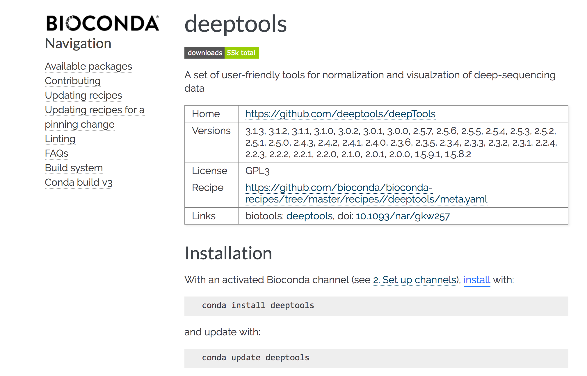
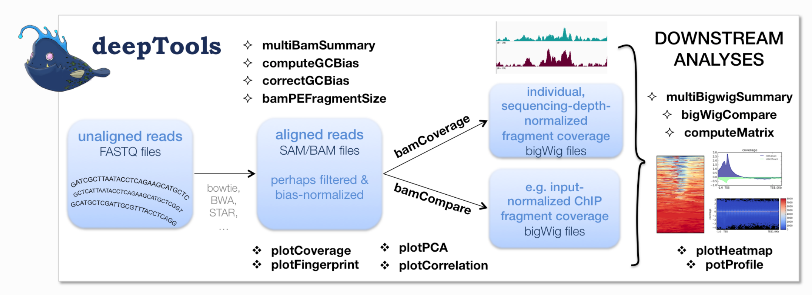
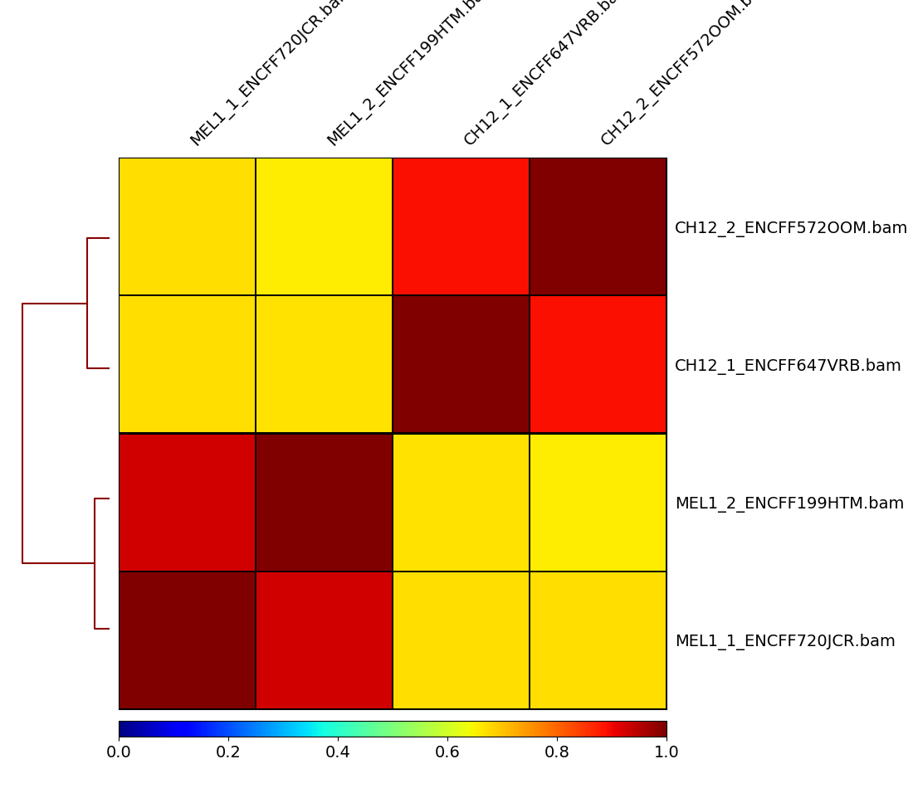
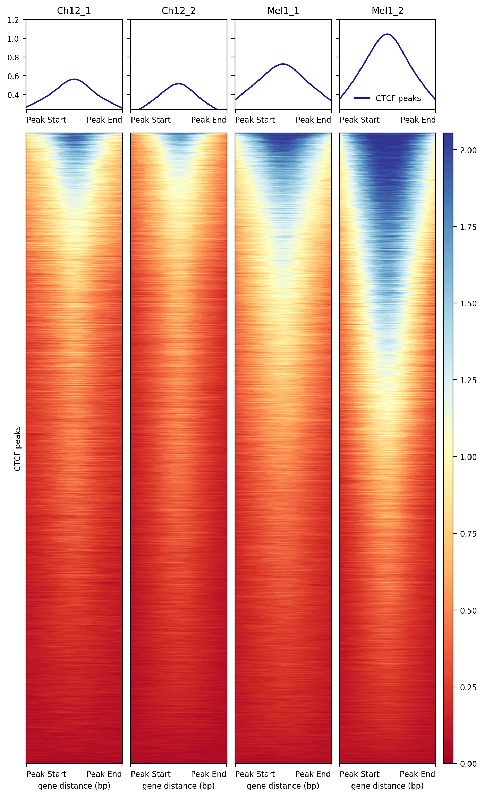
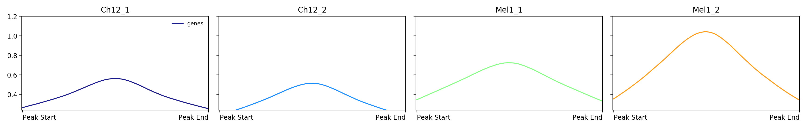
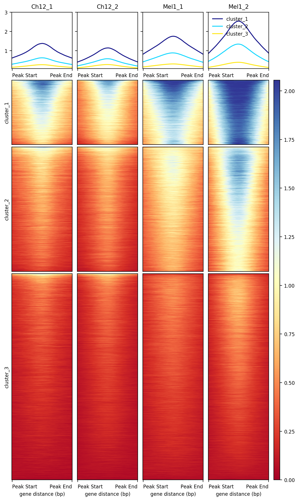
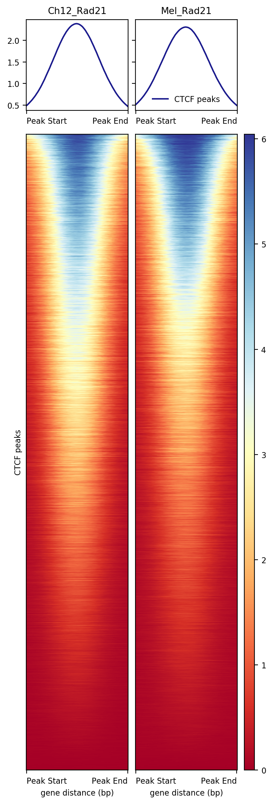
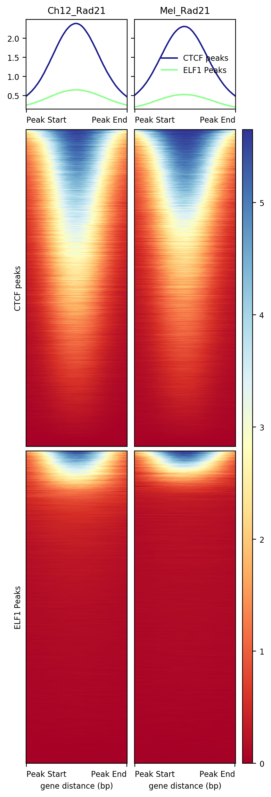
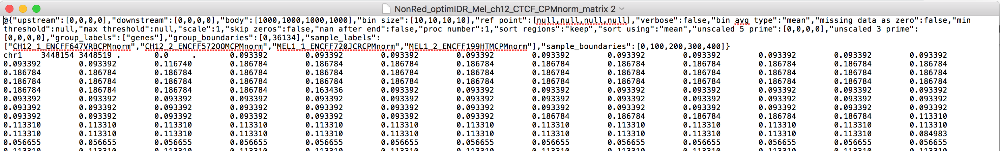
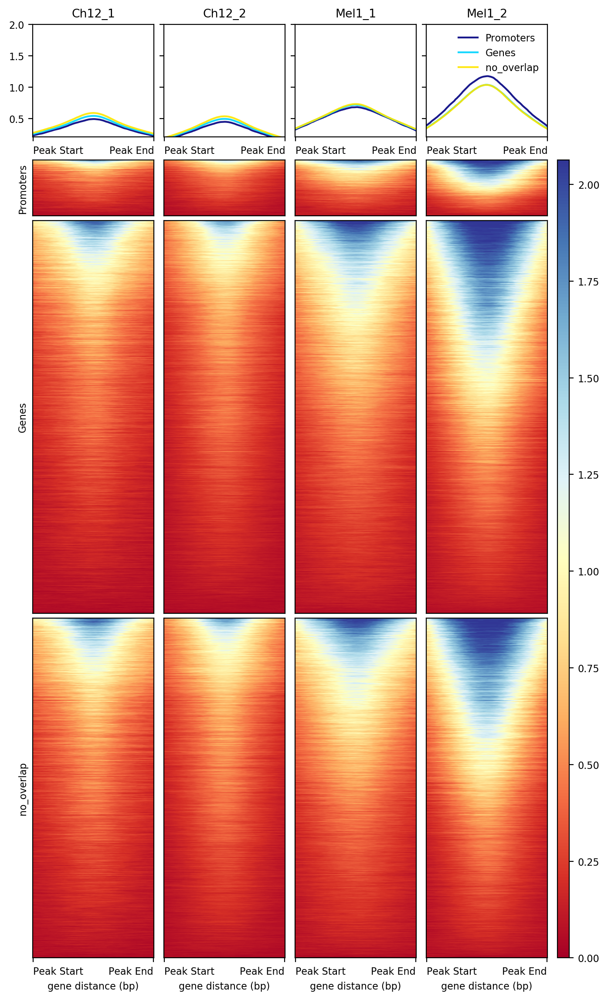

```{r setup, include=FALSE}
knitr::opts_chunk$set(echo = TRUE)
AsSlides <- TRUE
```

```{r, eval=F,include=F, cache=F}
library(GenomicRanges)
library(rtracklayer)

# downloaded "optimal IDR peaks" that were determined from both replicates of each cell line
peakFiles <- dir("../datafromEncode/",pattern="optimIDR",
                 full.names = TRUE)

macsPeaks_GR <- list()
for(i in 1:length(peakFiles)){
  macsPeaks_DF <- read.delim(peakFiles[i],
                             header = FALSE)
  colnames(macsPeaks_DF)[1:3] <- c("chr", "start", "end")
     macsPeaks_GR[[i]] <- GRanges(
     seqnames=macsPeaks_DF[,"chr"],
     IRanges(macsPeaks_DF[,"start"],
             macsPeaks_DF[,"end"]
     )
  )
}

macsPeaks_GRL <- GRangesList(macsPeaks_GR)
names(macsPeaks_GRL) <- peakFiles

macsPeaks_GR_CTCF <- macsPeaks_GRL[grepl("CTCF", names(macsPeaks_GRL))]
# Now we can produce our non-redundant set of peaks and score each of the peaks by their occurrence in our Mel and Ch12 samples.
allPeaksSet_nR_CTCF <- reduce(unlist(macsPeaks_GR_CTCF))
overlap_CTCF <- list()
for(i in 1:length(macsPeaks_GR_CTCF)){
  overlap_CTCF[[i]] <- allPeaksSet_nR_CTCF %over% macsPeaks_GR_CTCF[[i]]
}
overlapMatrix_CTCF <- do.call(cbind,overlap_CTCF)
colnames(overlapMatrix_CTCF) <- names(macsPeaks_GR_CTCF)
mcols(allPeaksSet_nR_CTCF) <- overlapMatrix_CTCF
allPeaksSet_nR_CTCF[1,]

export.bed(allPeaksSet_nR_CTCF, "./NonRed_optimIDR_Mel_ch12_CTCF.bed")

#will also use ELF1 peaks later on
macsPeaks_GR_ELF1 <- macsPeaks_GRL[grepl("ELF1", names(macsPeaks_GRL))]
# Now we can produce our non-redundant set of peaks and score each of the peaks by their occurrence in our Mel and Ch12 samples.
allPeaksSet_nR_ELF1 <- reduce(unlist(macsPeaks_GR_ELF1))
overlap_ELF1 <- list()
for(i in 1:length(macsPeaks_GR_ELF1)){
  overlap_ELF1[[i]] <- allPeaksSet_nR_ELF1 %over% macsPeaks_GR_ELF1[[i]]
}
overlapMatrix_ELF1 <- do.call(cbind,overlap_ELF1)
colnames(overlapMatrix_ELF1) <- names(macsPeaks_GR_ELF1)
mcols(allPeaksSet_nR_ELF1) <- overlapMatrix_ELF1
allPeaksSet_nR_ELF1[1,]

export.bed(allPeaksSet_nR_ELF1, "./NonRed_optimIDR_Mel_ch12_ELF1.bed")

library(Rsamtools)
#indexBam("./datafromEncode/CH12_1_ENCFF647VRB.bam")
#indexBam("./datafromEncode/CH12_2_ENCFF572OOM.bam")
#indexBam("./datafromEncode/MEL1_1_ENCFF720JCR.bam")
#indexBam("./datafromEncode/MEL1_2_ENCFF199HTM.bam")
#indexBam("./datafromEncode/mel_rad21_ENCFF403JXO.bam")
#indexBam("./datafromEncode/ch12_rad21_ENCFF426YVP.bam")

```

## Deeptools 
Deeptools is a popular command line genomics tool that can be downloaded from [Bioconda](https://bioconda.github.io/recipes/deeptools/README.html) (similar to MACS2, which we used for peak calling). 


---

## Deeptools functions

Deeptools allows for direct analysis of BAM files, including conversion of BAM to bigWig followed by the ability to dig deeper into where these reads are enriched within the genome. The [Deeptools manual](https://deeptools.readthedocs.io/en/develop/index.html#) is a great resource for all of the functions that can be used within the package.


---

## BAM files for analysis

BAM files for CTCF ChIPseq in the MEL (mouse erythroleukemia) and CH12 (mouse lymphoma) cell lines were downloaded from the encode data portal
* [MEL replicate 1](https://www.encodeproject.org/files/ENCFF720JCR/)
* [MEL replicate 2](https://www.encodeproject.org/files/ENCFF199HTM/)
* [CH12 replicate 1](https://www.encodeproject.org/files/ENCFF647VRB/)
* [CH12 replicate 2](https://www.encodeproject.org/files/ENCFF572OOM/)

NOTE: Prior to using the BAM files in Deeptools you need to [index each BAM file](https://rockefelleruniversity.github.io/Bioconductor_Introduction/r_course/presentations/slides/AlignmentInBioconductor.html#21) and have the '.bai' files in the same directory as the BAM files
---

## Correlation of BAM file reads

Two modes:
* **Count number of reads in specific regions (e.g. peaks) that you input**
* Divide the genome into bins and add up the reads within those bins 

Region method:
<small>
```{r,eval=F,echo=T}
system(paste("multiBamSummary BED-file",
             "--BED ./NonRed_optimIDR_Mel_ch12_CTCF.bed", 
             "-b ./datafromEncode/MEL1_1_ENCFF720JCR.bam", 
             "./datafromEncode/MEL1_2_ENCFF199HTM.bam", 
             "./datafromEncode/CH12_1_ENCFF647VRB.bam",
             "./datafromEncode/CH12_2_ENCFF572OOM.bam",
             "-o ./CTCF_ch12_mel_multiBamSummary_NRoptIDR.npz", sep = " "))


```

**NOTE: For these Deeptools slides we will use the non-redundant peaks in [MEL](https://www.encodeproject.org/files/ENCFF752ZTC/) and [CH12](https://www.encodeproject.org/files/ENCFF112IBI/) cells that were called by the Encode pipeline, which are selected using a method called Irreproducible discovery rate (IDR). These are slightly different from the peaks in earlier slides, which were selected based on being non-redundant and in both replicates of at least one cell line.**

---

## Correlation of BAM file reads
<small>
```{r,eval=F,echo=T}
system(paste("plotCorrelation --corData  CTCF_ch12_mel_multiBamSummary_NRoptIDR.npz", 
             "--corMethod spearman", 
             "--whatToPlot heatmap", 
             "-o ./plotCorrelation_CTCF_ch12_mel_NRoptIDR_heatmap.png", sep = " "))
```
<div align="center">

</div>
---

## Create bigWig files from BAM files

We learned how to make bigWig files within Bioconductor using the [coverage() and export.bw()](https://rockefelleruniversity.github.io/RU_ChIPseq/chipseq_course/Presentations/Slides/ChIPseq_In_Bioconductor.html#40) functions, here we can do this within Deeptools and normalize using CPM (counts per million).
<small>
```{r,eval=F,echo=T}
# record the full paths to the BAM files and save them in a vector
bamFiles <- dir("./datafromEncode/",
                pattern=".bam$", # '$' sign specifies end of line
                full.names = TRUE)

# generate normalized bigwigs
for (i in seq_along(bamFiles)) {
  bam_name <- gsub("\\..*","", 
                   basename(bamFiles[i])) # this will remnove the '.BAM' from the end of each path
  system(paste0("bamCoverage -b ", 
                bamFiles[i], 
                " --normalizeUsing 'CPM' -o ", 
                bam_name, "CPMnorm.bw"))
}

```
---

## computeMatrix and plotHeatmap  
To generate heatmaps over specific genomic regions, you must first produce a matrix containing enrichment scores (i.e. reads) using the 'computeMatrix' function. This function requires bigWig files (-S argument) as inputs and regions (-R argument) in which you want to quantify signal of those bigWigs. The output is a matrix containing this quantification and can be used for heatmaps and profile plots

Generate matrix and heatmap for CTCF signal in our replicates over the CTCF peaks:
<small>
```{r,eval=F,echo=T}
system(paste("computeMatrix scale-regions -R ./NonRed_optimIDR_Mel_ch12_CTCF.bed", 
             "-S CH12_1_ENCFF647VRBCPMnorm.bw", 
             "CH12_2_ENCFF572OOMCPMnorm.bw", 
             "MEL1_1_ENCFF720JCRCPMnorm.bw", 
             "MEL1_2_ENCFF199HTMCPMnorm.bw",
             "-o ./NonRed_optimIDR_Mel_ch12_CTCF_CPMnorm_matrix", sep = " "))
```
NOTE: 'computeMatrix' has two settings - here we use 'scale-regions' which makes all regions the same size. There is also 'reference-point', which will create new regions a specified distance upstream/downstream of a point within each range of a BED file (e.g. start, middle).

---
## computeMatrix and plotHeatmap  
To generate heatmaps over specific genomic regions, you must first produce a matrix containing enrichment scores (i.e. reads) using the 'computeMatrix' function. This function requires bigWig files (-S argument) as inputs and regions (-R argument) in which you want to quantify signal of those bigWigs. The output is a matrix containing this quantification and can be used for heatmaps and profile plots

Generate matrix and heatmap for CTCF signal in our replicates over the CTCF peaks:
<small>
```{r,eval=F,echo=T}
system(paste("computeMatrix scale-regions -R ./NonRed_optimIDR_Mel_ch12_CTCF.bed", 
             "-S CH12_1_ENCFF647VRBCPMnorm.bw", 
             "CH12_2_ENCFF572OOMCPMnorm.bw", 
             "MEL1_1_ENCFF720JCRCPMnorm.bw", 
             "MEL1_2_ENCFF199HTMCPMnorm.bw",
             "-o ./NonRed_optimIDR_Mel_ch12_CTCF_CPMnorm_matrix", sep = " "))
```

```{r,eval=F,echo=T}
system(paste("plotHeatmap -m NonRed_optimIDR_Mel_ch12_CTCF_CPMnorm_matrix", 
             "--samplesLabel 'Ch12_1' 'Ch12_2' 'Mel1_1' 'Mel1_2'", 
             "--regionsLabel 'CTCF peaks'",
             "--startLabel 'Peak Start'", 
             "--endLabel 'Peak End'",
             "--yMax 1.2",  
             "-o NonRed_optimIDR_Mel_ch12_CTCF_CPMnorm_matrix.png", sep = " "))
```
---

## computeMatrix and plotHeatmap
<div align="center">

</div>

---

## plotProfile function

The computeMatrix output can also be used to just get the enrichment profiles across these regions, though this is probably a bit easier using soGGi and the ggplot2 functionality
<small>
```{r,eval=F,echo=T}
system(paste("plotProfile -m NonRed_optimIDR_Mel_ch12_CTCF_CPMnorm_matrix", 
             "--samplesLabel 'Ch12_1' 'Ch12_2' 'Mel1_1' 'Mel1_2'", 
             "--startLabel 'Peak Start'", 
             "--endLabel 'Peak End'", 
             "--yMax 1.2", 
             "-o NonRed_optimIDR_Mel_ch12_CTCF_CPMnorm_matrix_profile.png", sep = " "))

```


---

## Built-in clustering for plotHeatmap 

Clustering can help you find different patterns between the samples. In our case it is helpful as it splits the data into clusters with high signal and low signal. Might also be helpful if you have some regions in which the signal goes up and some where it goes down between the conditions you are comparing.
<small>
```{r,eval=F,echo=T}
system(paste("plotHeatmap -m NonRed_optimIDR_Mel_ch12_CTCF_CPMnorm_matrix",  
       "--samplesLabel 'Ch12_1' 'Ch12_2' 'Mel1_1' 'Mel1_2'", 
       "--startLabel 'Peak Start' --endLabel 'Peak End'", 
       "--yMax 3", 
       "--kmeans 3", 
       "--outFileSortedRegions km3.bed", 
       "-o NonRed_optimIDR_Mel_ch12_CTCF_CPMnorm_matrix_km2.png", sep = " "))
```
---

## Built-in clustering for plotHeatmap 
<div align="center">

</div>

---

## Built-in clustering for plotHeatmap 

The '--outFileSortedRegions' argument in the plotHeatmap will output a bed file showing the cluster each range belongs to. We can import this as a GRanges object and do further analysis using Bioconductor tools 
<small>
```{r,eval=T,echo=T,warning=F,message=F}
library(rtracklayer)
km2_bed <- import.bed("./km3.bed")
km2_bed[1:2]
```


---
## Co-localization with other TFs 

CTCF co-localizes with the cohesin complex, which includes Rad21. We can use deeptools to look at enrichment of Rad21 within our CTCF peaks. 

BAM files for Rad21 ChIP from [MEL](https://www.encodeproject.org/files/ENCFF403JXO/) and [CH12](https://www.encodeproject.org/files/ENCFF426YVP/) cells were downloaded from encode. BAMs were indexed with Rsamtools and converted to bigWigs using the Deeptools 'bamCoverage' function as shown earlier.

Generate matrix and heatmap:
<small>
```{r,eval=F,echo=T}
system(paste("computeMatrix scale-regions -R ./NonRed_optimIDR_Mel_ch12_CTCF.bed", 
       "-S ch12_rad21_ENCFF426YVPCPMnorm.bw", 
          "mel_rad21_ENCFF403JXOCPMnorm.bw", 
       "-o ./NonRed_optimIDR_Mel_ch12_Rad21only_CPMnorm_matrix", sep = " "))

system(paste("plotHeatmap -m NonRed_optimIDR_Mel_ch12_Rad21only_CPMnorm_matrix", 
       "--samplesLabel  'Ch12_Rad21' 'Mel_Rad21'",
       "--regionsLabel 'CTCF peaks'",
       "--startLabel 'Peak Start'", 
       "--endLabel 'Peak End'",  
       "-o NonRed_optimIDR_Mel_ch12_Rad21only_CPMnorm_matrix.png", sep = " "))
```
---
## Co-localization with other TFs
<div align="center">

</div>
---
## Multiple region files 
We can also put multiple bed files into the command and look at whether certain samples have different enrichment across these groups. For example, you could look at signal in promoters vs gene bodies of different gene sets or different sets of peaks, which is what we will do here. 

ELF1 is another transcription factor that is not part of the cohesin complex, so is not expected to have significant overlap with Rad21. Here we will test this by inputing both the CTCF and ELF1 peaks to the computeMatrix function. The ELF1 peaks are also non-redundant IDR peaks from Encode for the [MEL](https://www.encodeproject.org/files/ENCFF885EHG/) and [CH12](https://www.encodeproject.org/files/ENCFF683MGY/) cell lines.

Generate matrix and heatmap:
<small>
```{r,eval=F,echo=T}
system(paste("computeMatrix scale-regions -R ./NonRed_optimIDR_Mel_ch12_CTCF.bed ./NonRed_optimIDR_Mel_ch12_ELF1.bed", 
       "-S ch12_rad21_ENCFF426YVPCPMnorm.bw", 
          "mel_rad21_ENCFF403JXOCPMnorm.bw", 
       "-o ./CTCF_ELF1peaks_Mel_ch12_Rad21only_CPMnorm_matrix", sep = " "))

system(paste("plotHeatmap -m CTCF_ELF1peaks_Mel_ch12_Rad21only_CPMnorm_matrix", 
       "--samplesLabel  'Ch12_Rad21' 'Mel_Rad21'",
       "--regionsLabel 'CTCF peaks' 'ELF1 Peaks'",
       "--startLabel 'Peak Start'", 
       "--endLabel 'Peak End'",  
       "-o CTCF_ELF1peaks_Mel_ch12_Rad21only_CPMnorm_matrix.png", sep = " "))
```
---
## Multiple region files
<div align="center">

</div>
---
## Manipulation of Deeptools matrix in R

Can we combine the functionality of Bioconductor and GRanges-based objects in R with the Deeptools quantification of reads and heatmap generation?

Output of computeMatrix function:
<div align="center">

</div>

---

## Manipulation of Deeptools matrix in R

General workflow: a Deeptools matrix (from computeMatrix) is imported into R as an object designed for easy manipulation using Bioconductor tools, and this object can then be exported out of R as a Deeptools matrix to be plotted with 'plotHeatmap'

This will allow for things like:
* overlaps with GRanges objects 
* customized clustering of ranges in R
* annotation of peaks (promoters, exons, etc)
* overlap of peaks with specific gene sets
* plotting of signal within ranges with R visualizations (e.g ggplot2)

---

## Manipulation of Deeptools matrix in R

Import Deeptools matrix into Bioconductor-friendly object

```{r, warning=F, message=F, cache=T}
library(DeepToolR)

deeptools_mat_R <- import_deepToolsMat("./NonRed_optimIDR_Mel_ch12_CTCF_CPMnorm_matrix")
deeptools_mat_R

```
---

## Using GRanges object to subset matrix

Here we will use a function within the package that subsets the Deeptools matrix based on overlap with GRanges objects. 

We will test the whether CTCF peaks are more likely to overlap with promoters or gene bodies. We can [extract these genomic features](https://rockefelleruniversity.github.io/Bioconductor_Introduction/r_course/presentations/slides/GenomicFeatures_In_Bioconductor.html#14) using the mm10 TxDB object.

```{r, warning=F, message=F, eval=F, echo=T}

library(TxDb.Mmusculus.UCSC.mm10.knownGene)
genes <- genes(TxDb.Mmusculus.UCSC.mm10.knownGene) # get genomic regions of genes
promoters <- promoters(genes) # get the promoters of these genes

```
---
## Using GRanges object to subset matrix

Here we use the 'subsetbyRangeOverlap' function to look at the enrichemnt of CTCF signal in genes and promoters, which are stored as GRanges objects

```{r, warning=F, message=F, eval=F, echo=T}
### Workflow using piping 
# The output from one function can be passed as the first argument of the next 
# function with the %>% operator
library(magrittr)

overlap_regions <- GRangesList(promoters, genes)
overlap_region_names <- c("Promoters", "Genes")

import_deepToolsMat("./NonRed_optimIDR_Mel_ch12_CTCF_CPMnorm_matrix") %>%
  subsetbyRangeOverlap(regions = overlap_regions, 
                       region_names = overlap_region_names) %>%
  export_deepToolsMat(con = "./deeptoolR_output_promoter_gene_matrix")

# use this output in Deeptools
system(paste("plotHeatmap -m deeptoolR_output_promoter_gene_matrix.gz", 
              "--samplesLabel 'Ch12_1' 'Ch12_2' 'Mel1_1' 'Mel1_2'",
              "--startLabel 'Peak Start'",
              "--endLabel 'Peak End'",
              "--yMax 2",
              "-o deeptoolR_output_promoter_gene_matrix.png", sep = " "))
```
---
## Using GRanges object to subset matrix

<div align="center">

</div>
---
